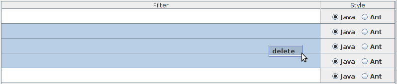
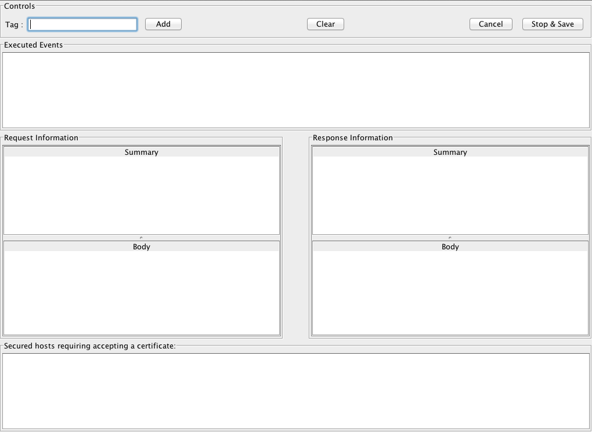

.. _recorder:

########
Recorder
########

Introduction
============

Gatling Recorder is a module which can help writing scenarios for Gatling. Indeed, it could be annoying to write a full scenario from scratch, that's why this module has been created.

This tool acts as a proxy between your browser and the web application you'd like to write a scenario for. Therefore, all you need to do is to navigate through your application as any user would do to record a scenario.

Currently, it is developed in Java and uses different libraries:

* Netty for non blocking I/O
* Scalate for the template engine

How to run it ?
===============

The recorder is launched thanks to a launch script (as is the engine)::

	~$ $GATLING_HOME/bin/recorder.sh

When done, the configuration interface will appear, allowing you to set the different parameters of the recorder.

Configuration
=============

.. image :: img/recorder/recorder-configuration_frame.png
	:alt: Configuration frame
	:scale: 70

Local ports
-----------

The recorder can log HTTP and HTTPS requests, therefore, it can listen on two ports, one for each protocol.

.. _recorder-browser-config:

Configuring your browser
^^^^^^^^^^^^^^^^^^^^^^^^

To use the recorder, you have to configure your browser so that it uses the recorder as a proxy. To do so, use the "Settings" menu of the browser.

.. image:: img/recorder/recorder-browser_settings.png
	:alt: Browser settings
	:scale: 70

In the "Advanced settings" tab, click on "Network" (or "Connection") and change the settings to the recorder ports for HTTP and HTTPS. Update also the "No Proxy for" setting so that it fits your need.

.. image:: img/recorder/recorder-browser_advanced_settings.png
	:alt: Browser advanced settings
	:scale: 70

.. note:: HTTPS port isn't mandatory if you don't plan to use an HTTPS connection.

Outgoing proxy
--------------

If you must access your web application through a proxy, you can set it up in this section. As the configuration of local ports, two different ports can be defined for the outgoing proxy (HTTP & HTTPS).

.. note:: If HTTP and HTTPS are on the same port for the outgoing proxy, you need to explicitly specify both.

Filters
-------

One may want not to log certain requests, or only some of them. For this purpose, the recorder provides filters that can will be applied on the requests' URI passing through it.

To select whether the requests should be discarded or logged if their URI matches a filter, you can choose which strategy should be used:

* **NONE:**: Doesn't apply any filter one the requests, even if there are some declared;
* **EXCEPT**: Allows all requests to be logged **except** those which filters apply on the URI;
* **ONLY**: Allows **only** requests, which URI matches one of the filters, to be logged.

Press the ``+`` button to add filters. Once a filter is in the table, you can choose the type of the pattern:

* **Java**: The classic regular expression implemented with Java;
* **Ant**: A more user-friendly pattern.

**Example**: To exclude all css files with Ant pattern, specify: ``/**/*.css``. The easiest way is to specify: ``*.css``, but this pattern will exclude all css files located **only** at the root of the path.

The ``-`` button is used to delete one or more entries in the table. The right click is also defined to remove directly one or many entries at the same time.

The ``Clear`` button removes all filters.

Output
------

Once you have recorded all the requests you wanted, the recorder will save them as a Gatling scenario. Therefore, you need to specify in which folder the generated scenario(s) will be saved. You can either write the path of the folder yourself, or use the ``Browse`` button to get the required folder.

.. note:: If you specify a non-existing folder, Gatling Recorder will create it for you. Therefore, the specified path must be writable. Don't make mistakes ;-).

Preferences
-----------
Next to the ``Start`` button, you'll find a "Save preferences" checkbox. If selected, all the configuration settings will be saved in the ``gatling-recorder.ini`` file located in your home directory.

The next time the recorder will run, all the configuration will be imported automatically from this file.

.. note:: To remove saved preferences, delete the ``gatling-recorder.ini`` file. But if it's just for a one-time run, use the ``Clear`` button and unselect the "Save preferences" checkbox.

Start
-----

Once everything has been configured, press the ``Start`` button to launch the recorder.

Running...
==========

Recorded Events
---------------

As you navigate through your application, the recorder will log three kinds of events:

* **Requests**: The requests sent by your browser
* **Pauses**: The time between each request
* **Tags**: These are markers that you can set manually

Request Events
^^^^^^^^^^^^^^

Even though all requests sent by your browser are transfered by the recorder, only those passing through filters are shown in the list of events and will be saved in the scenarios.

When you click on a request, information about this request and its response are respectively shown in the "Request" and "Response" text areas located below the list of events.

If the request contains a body, it will be displayed in the last text area labeled "Request Body".
The recorder automatically saves request bodies in a folder located in the output folder defined earlier.

In the list of executed events, requests are displayed like this: ``Request Method | Request URI``

**Example**: ``GET | http://www.ebusinessinformation.fr/``

Pause Events
^^^^^^^^^^^^

Pauses are automatically calculated during the scenario between two requests logged by the recorder. Depending on the scale of the duration, two types of precision will be used:

* If the pause duration is less than 1 second, the precision will be of +/- 100ms;
* If the pause duration is more than 1 second, the precision will be of +/- 1s.

In the list of executed events, pauses are displayed like this: ``PAUSE | XXunit``

**Example:** ``PAUSE | 4s``

Tag Events
^^^^^^^^^^

To make your scenario more understandable, you can add tags, they will appear as comments in the scenario: ``/* my tag */``

To add a tag, fill in the text field provided and press the ``Add`` button. After that, the tag will be displayed in the list below.

**Example:** ``TAG | my tag``

Clear
-----

The ``Clear`` button removes all logged events. It allows you to restart the recording from scratch.

Stop
----

When you have finished recording your scenario, press the ``Stop`` button to save it.

A word about recording over HTTPS
=================================

The recorder ships its own auto signed certificate. 

* If the browser hasn't already registered a certificate for this domain, it will automatically prompt asking for accepting Gatling's certificate. Note that browsers only do so for the certificate of the main url, note for the resources loaded in the page, such as images hosted on a secured external CDN. If you have such resources, you'll have to first browse manually to these other domains in order to accept Gatling's certificate for them. Gatling will list all secure domains that you browse in order to help you register certificates (note that it can't tell apart already accepted certificates, and to be accepted ones).
* If the browser has already registered a validated certificate for this domain, the browser will detect Gatling as a security breach (well, that's what man-in-the-middle softwares are usually about) and will refuse to load the page. If so, you have to remove the trusted certificate from you your browser's keystore.

Command Line Options
====================

For those who prefer the command line, command line options can be passed to the gatling-recorder:

* **-lp**: Local port (alias = **--local-port**)
* **-lps**: Local SSL port (alias = **--local-port-ssl**)
* **-ph**: Outgoing proxy host (alias = **--proxy-host**)
* **-pp**: Outgoing proxy port (alias = **--proxy-port**)
* **-pps**: Outgoing proxy SSL port (alias = **--proxy-port-ssl**)
* **-of**: Output folder for results (alias = **--output-folder**)
* **-rbf**: Folder for requests bodies (alias = **--request-bodies-folder**)
* **-cn**: Name of the generated class (alias = **--class-name**)
* **-pkg**: Package of the generated class (alias = **--package**)
* **-enc**: Encoding used in the Recorder (alias = **--encoding**)
* **-fr**: Enable "Follow Redirects"  (alias = **--follow-redirect**)

.. note:: Command line options override saved preferences.