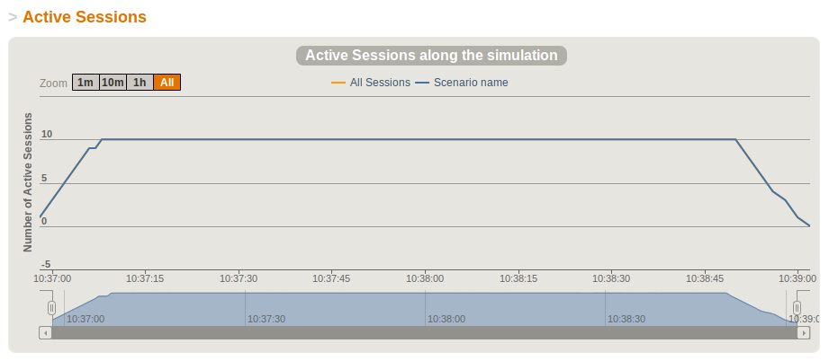

.. _first-steps-with-gatling:

########################
First Steps With Gatling
########################

Here you are, waiting to know all about Gatling and all its secrets to achieve incredibly powerful performance testing.

This page and the next one will guide you through most of the features. You'll learn about simulations, scenarios, feeders, recorder, loops, scala functions, etc. But don't worry, this won't be painful, we'll take care of you during this journey through the amazing Gatling!

Our mission during these two pages will be to test an e-banking application hosted on Cloud Foundry. We will first decide what scenario we want to create, then, we'll create it thanks to the Gatling Recorder and run it to see how the application behaved during the performance test.

.. note::
	**You can see the resulting simulation files in the Gatling bundle, they are stored under user-files/simulations:**

	* `basic <https://github.com/excilys/gatling/blob/1.5.X/gatling-bundle/src/main/assembly/assembly-structure/user-files/simulations/basic/BasicExampleSimulation.scala">`_
	* `advanced <https://github.com/excilys/gatling/tree/1.5.X/gatling-bundle/src/main/assembly/assembly-structure/user-files/simulations/advanced>`_

You're going to see some Scala, but don't panic!
================================================

Yes, the Gatling simulation scripts are Scala classes.

No, it won't be painful, Gatling doesn't expect you to be a hardcore Scala hacker, but just to read this manual so you can learn the DSL.

However, once in a while, you might run into a specific use case that's not supported out of the box and then want to write your own components. If you write complex simulations, you might want to split them into multiple classes/objects. In this case, you can :

* learn Scala. One very good starting point is `Twitter's Scala School <http://twitter.github.com/scala_school>`_
* join the Google Group and ask for help

Anyway, the Gatling DSL should suffice for most current needs.

For the non Scala people, here's what a Gatling simulation class look like::

	package foo.bar (1)
	import com.excilys.ebi.gatling.core.Predef._ (2)
	import com.excilys.ebi.gatling.http.Predef._
	import com.excilys.ebi.gatling.jdbc.Predef._
	import Headers._
	import akka.util.duration._
	import bootstrap._
	import assertions._

	class SimulationWithFollowRedirect extends Simulation { (3)
	  // your code starts here
	  val scn = scenario("My scenario")
	            .exec(http("My Page")
	              .get("http://mywebsite.com/page.html")) (4)
	  
	  setUp(scn.users(10)) (5)
	  // your code ends here
	}

1. the optional package
2. the required imports
3. the class declaration. Note that your simulation extends Simulation
4. your scenario definition. ``val`` is the keyword for defining a non-re-assignable value
5. the list of the scenarios declared in the class.

The application under test
==========================

In this tutorial, you'll be playing with an e-banking application named 'excilys-bank' deployed on Cloud Foundry at the following url:

http://excilysbank.gatling.cloudbees.net

This application was developed by `eBusiness Information, Excilys Group <http://www.ebusinessinformation.fr>`_ to serve as a testing base for Gatling's performances.

Indeed, it was developed with performance and code quality in mind, which lead to an quite fast and responsive application. The source is available `here on Github <https://github.com/excilys/excilys-bank>`_.

The main features available in this application are:

* Session management (login, logout)
* Accounts visualization
* Operations visualization by month
* Cards Operations visualization by month
* Transfers visualization and transfer performing

Planning the test
=================

To test the performance of this application, we'd like to create scenarios representative of what really happens when users navigate it. So we tried to imagine what a real user would do with our application, shrank it and we got the following:

1. The user accesses to the application
2. The user enters its credentials and logs in
3. The user accesses to the details of one of its accounts
4. The user accesses to the operations of the previous month
5. The user logs out

.. note:: If the scenario was shrunk it is to be the clearest possible in the rest of this tutorial.

Now that we have decided what would be the common use of our application, we can create the scenario for Gatling.

Gatling Recorder
================

To ease the creation of scenarios, we will use the :ref:`Recorder`, a tool provided with Gatling that allows you to record your actions on a web application and export them as Gatling scenarios.

This tool is launched with a script located in the bin directory along the gatling one::

	~$ $GATLING_HOME/bin/recorder.sh

Configuration
-------------

Once launched, you get the following GUI, which lets use configure how requests and response will be recorded:

.. image:: img/recorder-configuration_frame.png
	:alt: Gatling Recorder - Configuration Frame
	:scale: 60

After configuring the recorder, all you have to do is to start it and configure your browser to use Gatling Recorder's proxy.

.. note:: For information about how to configure your browser, you can check out the :ref:`Recorder's documentation <recorder-browser-config>`.

Recording the scenario
----------------------

All you have to do now is to browse the application:

1. Go to the website: http://excilysbank.gatling.cloudbees.net
2. Authenticate using these credentials:

 * username = ``user1``
 * password = ``password1``

3. Click on ``PERSONNAL_CHECKING``
4. Click on the previous month (for us it was November as we were in December)
5. Log out

.. note:: Try to act as a user, don't jump from one page to another without taking the time to read; this will make your scenario closer to real user behavior.

When you have finished to play the scenario, you can click on ``Stop``, and your first Gatling scenario will be created by the recorder. Its name will be ``SimulationYYYYMMDDHHMMSS.scala``

The Gatling scenario corresponding to our example is available in the folder ``user-files/simulations/basic`` of your Gatling installation under the name ``BasicExampleSimulation.scala``.

Gatling scenario explained
==========================

So now you've got a file with some mysterious dialect written in it. Nice! but... what does this mean? Don't worry, we are going to decrypt these bizarre words for you :-)

This file is a real Scala class, whose unique method ``apply`` contains 4 different parts:

* The HTTP protocol configuration
* The headers definition
* The scenario definition
* The simulation definition

HTTP protocol configuration
---------------------------

The first element is the configuration of the HTTP protocol.
In this example, this configuration is very basic and just defines the base URL that will be prepended to all the relative paths in the scenario definition.
Here, the base URL is ``http://excilysbank.gatling.cloudbees.net``.

The HTTP Configuration is stored as a Scala value so that we can set it later in the simulation definition.

Headers definition
------------------

As you'll see later, when we define the scenario for Gatling, we can provide the headers used for each request sent to the server. As the file was generated by the recorder, all headers are declared in the beginning of the file and used in the scenario definition.

.. note:: Adding common headers can seem useless, but don't forget that they add load on your server, thus they *are* important and should not be forgotten.

Headers are declared as Scala Maps::

	val headers_1 = Map(
	  "Accept" -> "text/html,application/xhtml+xml,application/xml;q=0.9,*/*;q=0.8",
	  "Accept-Charset" -> "ISO-8859-1,utf-8;q=0.7,*;q=0.7",
	  ...
	)

Scenario definition
-------------------

After the headers definition, you'll find the scenario definition. This definition has a name because you can define :ref:`several scenarios in the same simulation <multi-scenarios>`; it is usually stored in a Scala value: ``val scn = scenario("Name of my Scenario")...``

The scenario structure is basically made of two methods: ``exec`` and ``pause``. The first one is used to describe an action, usually a request sent to the tested application; the second one is used to simulate the thinking time of the user between pages. 

HTTP requests are defined as follows in a scenario::

	    http("request_3")
	      .post("/login")
	      .headers(headers_3)
	      .param("username", "user1")
	      .param("password", "password1")

The example above produces a POST HTTP request that authenticate the user with its credentials::
    
    POST http://excilysbank.gatling.cloudbees.net/login 
    Accept: text/html,application/xhtml+xml,application/xml;q=0.9,*/*;q=0.8
    Accept-Charset: ISO-8859-1,utf-8;q=0.7,*;q=0.7
    Accept-Encoding: gzip,deflate
    Accept-Language: fr,en-us;q=0.7,en;q=0.3
    Host: excilysbank.gatling.cloudbees.net
    Keep-Alive: 115
    User-Agent: Mozilla/5.0 (X11; U; Linux i686; en-US; rv:1.9.2.17) Gecko/20110422 Ubuntu/9.10 Firefox/3.6.17
    Content-Length: 33
    Content-Type: application/x-www-form-urlencoded
    Referer: http://excilysbank.gatling.cloudbees.net/public/login.html

    username=user1&password=password1

Simulation definitions
----------------------

The last part of the file contains the simulation definition, this is where you define the load you want to inject to your server, eg::

	setUp(
	    scn.users(1).protocolConfig(httpConf)
	)

Here Gatling will simulate **one user** behaving as we did. The protocolConfig is also added to the simulation to set the base URL.

.. _long-scenarios:

Long scenarios
--------------

.. note::Since v1.0.2

In case of long scenarios (more than 50 requests), the recorder will split them in chains::

	[...]

	val chain_1 = exec(...)...
	val chain_2 = exec(...)...

	val scn = scenario("My Scenario")
	            .exec(chain_1)
	            .exec(chain_2)

	[...]

You should be aware that if you have a long chain of methods, the Scala compiler will need more stack memory to be able to compile it (See :ref:`FAQ <faq-stack-overflow>`). That is why the recorder splits the scenario when saving it.

More users = more load!
=======================

So, this is great, we can load test our server with... one user! We are going to increase the number of users to show you another great feature of Gatling: feeders.

Increasing the number of users
------------------------------

To increase the number of simulated users, all you have to do is to change the configuration of the simulation as follows::

	scn.users(10).protocolConfig(httpConf)

.. note:: Here we set only 10 users, because we don't want to flood our test web application, please be kind and don't crash our Cloudbees instance ;-)

For more information about Feeders, see the :ref:`feeders` reference section.

Ramping for the win!
--------------------

If you want to simulate 3 000 users, you don't want them to start at the same time. Indeed, they are more likely to connect to your web application gradually.

Gatling provides the ``ramp`` option to implement this behavior. The value of the ramp indicates the duration over which the users will be linearly started. Just like every duration in Gatling, the default unit is second.

::

	scn.users(10).ramp(10) // 10 users/10s = 1 user/s
	scn.users(10).ramp(20) // 10 users/20s = 0.5 user/s = 1 user every 2s
	scn.users(1000).ramp(100) // 1000 users/100s = 10 users/s

In our scenario, we will set a ramp of 10 seconds.

Dynamic values with Feeders
---------------------------

We have set our simulation to run 10 users, but they all use the same credentials. Wouldn't it be nice if every user could use its own credentials? This is where Feeders will be useful. 

Feeders are data sources containing all the values you want to use in your scenarios. There are several types of Feeders, the simpliest being the CSV Feeder: this is the one we will use in our test. Feeders are explained in details in the :ref:`feeders` reference. 

Here are the feeder we use and the modifications we made to our scenario:

::

	/* user_information.csv */
	username,password,account_id
	user1,password1,4
	user2,password2,7
	...
	user10,password10,34

::

	/* Scenario */
	.feed(csv("user_information.csv"))
	.exec(
	  http("request_3")
	    .post("/login")
	    .param("username", "${username}")
	    .param("password", "${password}")
	    .headers(headers_3)
	    .check(status.is(302))
	)
	...
	.exec(
	  http("request_5")
	    .get("/private/bank/account/ACC${account_id}/operations.html")
	    .headers(headers_5)
	)

.. note:: the ${...} expression are part of Gatling EL described in :ref:`Advanced Usage <the-session>`.

Repeating actions
=================

Most of the users of web applications will repeat actions while navigating. To represent this behavior, Gatling brings **loops** to you. These loops can be conditioned by either a number of repetitions, a time limit or a condition::

	repeat(10) { // Will repeat the actions 10 times
	    exec( http(...) ... )
	    .pause(...)
	}
	OR
	.during(20 seconds) { // Will repeat the actions for at least 20s
	    exec( http(...) ... )
	    .pause(...)
	}

.. note:: For more information about conditional loops, you can check the :ref:`reference <asLongAs>`.

In our scenario, we will set a loop with 5 iterations after the login::

	.exec(
	  http("request_3")
	    ...
	)
	.pause(0 milliseconds, 100 milliseconds)
	.repeat(5) {
	    exec(
	      http("request_4")
	        ...
	    )
	    ...
	    .exec(
	      http("request_8")
	        ...
	    )
	    .pause(6, 7)
	}

Running the simulation
======================

Great! We have completely defined our first scenario, now we want to run it with Gatling. To do so, all we have to do is to move the file in ``user-files/simulations/`` and run Gatling as seen in :ref:`getting-started`.

Choose your simulation and press **Enter** to run it! Here is what it looks like:

.. image:: img/cli_gatling_basic_usage.png
	:alt: Gatling's Command Line
	:scale: 60

Analyzing the simulation
========================

When the simulation is done, Gatling generates reports for you to be able to analyze what happened during the simulation and detect performance caveats in your application.

For comprehensive information about these reports see :ref:`reports`.

Active Sessions
---------------

This report simply shows the number of active sessions (or active users) per second during the simulation:

.. note:: As we will see in :ref:`Advanced Usage <multi-scenarios>`, there might be several sessions corresponding to the different scenarios used in the simulation.

Number of Requests per Second
-----------------------------

This report shows the number of requests per second that Gatling sent to your application. This gives you an idea of the load that was generated during the simulation.

.. image:: img/requests_basic_usage.png
	:alt: Requests per Second Report
	:scale: 70

Request Details
---------------

These reports contain various charts and some statistics about the request they present:

.. image:: img/req_details_basic_usage.png
	:alt: Request Details Report
	:scale: 70

Going Further
=============

That's it for the basics, you can now write simple scenarios and load test basic applications, but there is more in Gatling. To discover and learn the advanced features of Gatling, read :ref:`advanced-usage`.