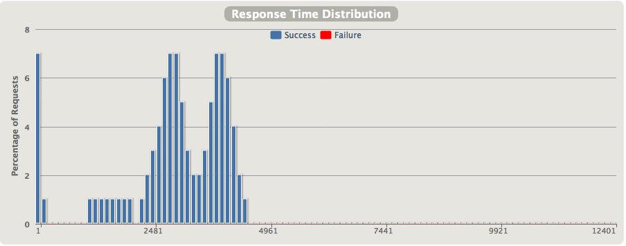

*******
Reports
*******

Overview
~~~~~~~~

Global menu points to consolidated statistics.

Details menu points to per-request-type statistics.

    Note: Reports can be generated from the simulation.log file even if
    the scenario was interrupted (Ctrl+C ou process killed), use the
    ``-ro`` option. See `Configuration page
    <https://github.com/excilys/gatling/wiki/Configuration#wiki-cli-options>`__.

Indicators
~~~~~~~~~~

.. figure:: img/charts-indicators.png
   :alt: DetailsIndicators

   DetailsIndicators

This chart shows response time are distributed among standard ranges. >
Note: these ranges can be configured in the ``gatling.conf`` file.

The right panel shows some standard statistics such as min, max, average
and standard deviation. > Note: these percentages can be configured in
the ``gatling.conf`` file.

Active sessions over time
~~~~~~~~~~~~~~~~~~~~~~~~~

.. figure:: img/charts-sessions.png
   :alt: ActiveSessions

   ActiveSessions

This chart displays the active users along the simulation : total and
per scenario.

Response time distribution
~~~~~~~~~~~~~~~~~~~~~~~~~~

   ReponseTimeDistrib

This chart displays the distribution of the response times.

Requests per second over time
~~~~~~~~~~~~~~~~~~~~~~~~~~~~~

.. figure:: img/charts-requests-per-sec.png
   :alt: RequestsPerSecond

   RequestsPerSecond

This chart displays the number of requests per second over time : total,
successes and failures.

Total transactions per second over time
~~~~~~~~~~~~~~~~~~~~~~~~~~~~~~~~~~~~~~~

.. figure:: img/charts-transactions-per-sec.png
   :alt: TransactionsPerSecond

   TransactionsPerSecond

This chart displays the number of response received per second over time
: total, successes and failures.

Response Time over time
~~~~~~~~~~~~~~~~~~~~~~~

.. figure:: img/charts-response-time.png
   :alt: ResponseTimeOverTime

   ResponseTimeOverTime

The response time is the duration between the beginning of the request
emission and the end of the response reception. This chart shows the
response time distribution over time for the given request.

Latency over time
~~~~~~~~~~~~~~~~~

.. figure:: img/charts-latency.png
   :alt: LatencyOverTime

   LatencyOverTime

The latency is the duration between the end of the request emission and
the beginning of the response reception. This chart shows the latency
distribution over time for the given request.

Response Time over load
~~~~~~~~~~~~~~~~~~~~~~~

.. figure:: img/charts-response-time-over-load.png
   :alt: ResponseTimeOverLoad

   ResponseTimeOverLoad

This chart shows how the response time for the given request is
distributed, depending on the total load of the application at the same
time.
