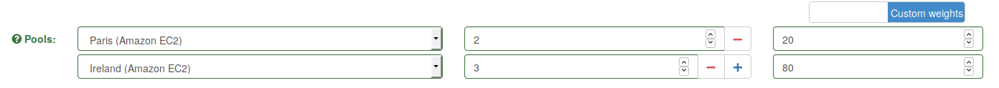

.. _scaling-out:

###########
Scaling Out
###########

Sometimes, generating some very heavy load from a single machine might lead to saturating the OS or the network interface controller.

In this case, you might want to use several Gatling instances hosted using multiple machines.

Scaling out easily with Gatling FrontLine
=========================================

The clustering mode is a built-in feature of `Gatling FrontLine <https://gatling.io/gatling-frontline/>`_, our enterprise version. It will run your tests on multiple load injectors, aggregate your results live and close the instances after the tests.

These injectors can be deployed on an on-premises instances, or on the cloud: Amazon Web Services, Google Cloud Platform, Microsoft Azure, Digital Ocean, ...

Scaling out with Gatling open-source
====================================

Gatling open-source doesn't have a cluster mode, but you can achieve similar results manually. You will have to configure all your load injectors, and aggregate the results manually. The steps are:

* deploy Gatling on several machines along with the Simulation classes and the associated resources (data, bodies, etc..)
* launch them remotely from a script, with the ``-nr`` (no reports) option
* retrieve all the simulation.log files
* rename them so they don't clash
* place them into a folder in the results folder of a Gatling instance
* generate the reports with Gatling with the ``-ro name-of-the-simulation-folder`` (reports only), Gatling will pick all the files that match ``.*\.log``

Example script using the above commands: (the script will run the same simulation parallel on given hosts, gather logs and generate a single report)

.. includecode:: code/GatlingScalingOut.sh
