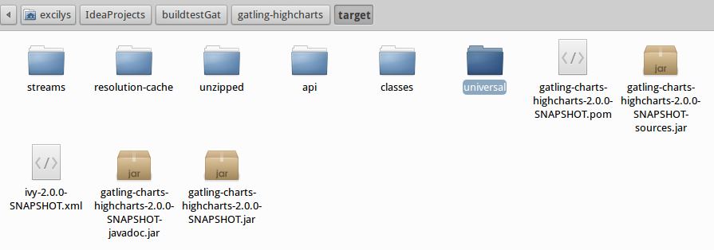
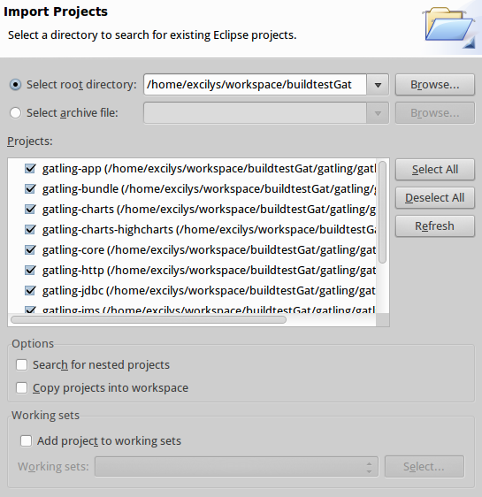
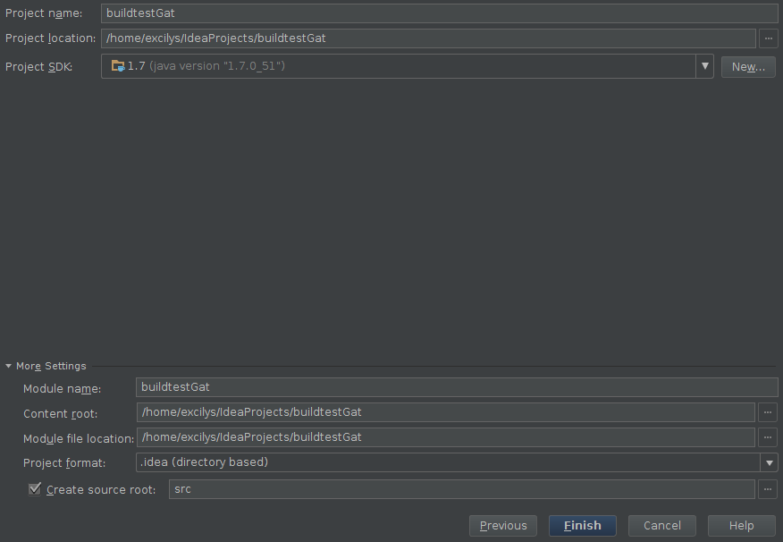
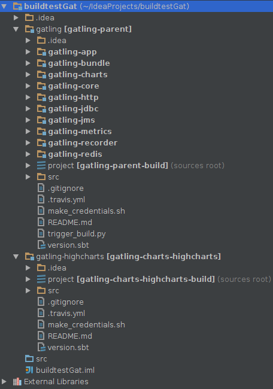

######################################
Building Gatling
######################################

.. note:: We use `Travis CI <https://travis-ci.org/excilys/gatling>`_ for continuous integration. You can find the latest snapshot on `Sonatype <https://oss.sonatype.org/content/repositories/snapshots/io/gatling/highcharts/gatling-charts-highcharts/2.0.0-SNAPSHOT/>`_

How to build
============

For legal reasons, Gatling is divided into two projects. The first one is Gatling, which you probably already know of, and Gatling Highcharts, which uses the first one as a dependency. Let's proceed by steps :

1. Make sure you have the `Scala <http://www.scala-lang.org/download/all.html>`_ library available somewhere.

.. warning:: Be sure to download the 2.10.4 version

2. If you use IntelliJ, create a new Scala project (refer to IDE integration section below if needed), otherwise simply create an empty folder. This will be where both Gatling and Gatling Highcharts sources will be located.
3. Then go inside the newly created folder and do a ``git clone https://github.com/excilys/gatling.git`` and ``git clone https://github.com/excilys/gatling-highcharts.git``. Your folder now looks like this :

.. image:: img/folder_after_clone.png
	:align: center
	:alt: Folder status after cloning

|  

4. Since Gatling is Scala-based, you'll also need **SBT** (Scala Build Tool) to build it. You can refer to the official `installation guide <http://www.scala-sbt.org/release/docs/Getting-Started/Setup.html>`_. The simplest way to install it if you're on Unix is to run :

::

  wget http://apt.typesafe.com/repo-deb-build-0002.deb
  sudo dpkg -i repo-deb-build-0002.deb
  sudo apt-get update
  sudo apt-get install sbt

5. Now go into the *gatling* folder with a command prompt and start SBT's interactive mode with ``sbt``. Then just run the ``publishLocal`` command to publish the project's artifacts to the local Ivy repository. Type ``exit`` to return to your command prompt.
6. Go to your *gatling-highcharts* folder and with SBT's interactive mode run ``;update;clean;publishLocal``. This will resolve highcharts' dependencies, clean the target directories and give us what we need. For more informations on SBT's commands, feel free to check the `command line reference <http://www.scala-sbt.org/release/docs/Detailed-Topics/Command-Line-Reference>`_. 
7. Finally, you can use your explorer to go to your ``gatling-highcharts/target/`` which should look like this :

You will find a zipped version of the builded project in ``/universal``. You can now extract it where you want and run the gatling script in ``/bin``.

IDE integration
===============

-----------------
Eclipse/Scala IDE
-----------------

To import Gatling's sources in Eclipse, you'll need the *sbteclipse* plugin for SBT. Everything you need to know about its installation is in the `documentation <https://github.com/typesafehub/sbteclipse/wiki>`_. Typical installation is this :

1. Make sure you have Scala IDE installed (in Eclipse :``Help -> Eclipse Marketplace -> Scala IDE``).
2. Go to your ``~/.sbt/0.x/plugins`` folder
3. If there is no folder just create it, along with a file named ``build.sbt``.
4. Put the following line in the file. Doing so will add *sbteclipse* as a global plugin, available for all your projects. You can also do that on a per-project basis if needed, see the documentation. 

``addSbtPlugin("com.typesafe.sbteclipse" % "sbteclipse-plugin" % "2.4.0")``

5. With a command prompt go to each project (*gatling* and *gatling-highcharts*) to start SBT's interactive mode with ``sbt`` and run the ``eclipse`` command to generate the Eclipse project definition files.
6. Once you generated the Eclipse project definition files you can launch the ``Import...`` wizard and click on ``Existing Projects into Workspace``. Select the root folder of both projects and confirm !

|  

-------------
IDEA IntelliJ
-------------

1. Make sure you have the Scala plugin installed (``File -> Settings -> Plugins``) 
2. Create a new **Scala** project (with Scala 2.10.4) and click ``Next``.
3. Give a name to your main projet :

| 
 
4. Click on ``Import Module...``. Select the ``gatling`` project and import it as an SBT project. Make sure you check ``Use auto-import``. Repeat for project *gatling-highcharts*.
5. Wait for all the dependencies to be resolved and you're done !

|  

Building the documentation
==========================

The official Gatling documentation uses `Sphinx <http://sphinx-doc.org>`_. You'll need to install Sphinx if you want to build the documentation.

1. On Unix you can run ``apt-get install python-sphinx``. For other systems see the `installation guide <http://sphinx-doc.org/install.html>`_. The ``which sphinx-quickstart`` command will show you if install was successful. 
2. You will find the source files inside the ``gatling/src/sphinx`` folder. To build them you can go in the ``src`` folder and run ``sphinx-build -b html sphinx/ sphinx/builded``. The generated files will be in ``gatling/src/sphinx/builded``. See the `command reference <http://sphinx-doc.org/invocation.html>`_ for more informations.

Sphinx uses the `reStructuredText <http://docutils.sourceforge.net/rst.html>`_ markup language. It's easy to pickup so feel free to contribute by adding new pages or submitting corrections. There is also a handy `cheat sheet <http://openalea.gforge.inria.fr/doc/openalea/doc/_build/html/source/sphinx/rest_syntax.html>`_ available.

