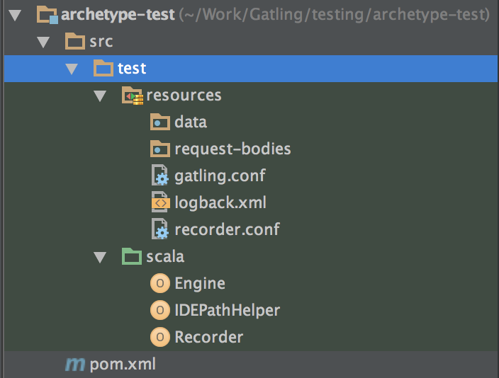

.. _maven-archetype:

###############
Maven Archetype
###############

Gatling's Maven Archetype allows you to integrate Gatling and run it into your preferred IDE.

Versions
========

Check out available versions on `Maven Central <http://search.maven.org/#search%7Cgav%7C1%7Cg%3A%22io.gatling.highcharts%22%20AND%20a%3A%22gatling-highcharts-maven-archetype%22>`.

Beware that milestones (M versions) are undocumented and releases for Gatling customers.

Prerequisites
=============

You need :

* an IDE which supports Scala, like `Scala IDE <http://scala-ide.org/>`__ or `IntelliJ IDEA <https://www.jetbrains.com/idea/>`__.
* `Maven <http://maven.apache.org/>`__

Creating a project using the Archetype
======================================

The Maven's coordinates for the archetype are ``io.gatling.highcharts:gatling-highcharts-maven-archetype``.

You can either use your IDE's facilities for creating a new project using a Maven archetype or, from the command line, type::

  mvn archetype:generate

Then, when prompted::

  Choose a number or apply filter (format: [groupId:]artifactId, case sensitive contains):

Type ``gatling``. You should then see::

  Choose archetype:
  1: remote -> io.gatling.highcharts:gatling-highcharts-maven-archetype (gatling-highcharts-maven-archetype)

Type ``1`` to select the archetype, then select the version to use (We recommend to always use the latest version.

Select the ``groupId``, ``artifactId`` and package name for your classes before confirming the archetype creation.

Finish by importing the archetype into your preferred IDE.

Using the Archetype
===================

After importing the project, its structure should look like that:

The archetype structure closely follows the bundle's structure :

* ``data`` is where the files for your feeders are to be stored
* ``bodies`` is where your request bodies are to be stored
* Your simulations will live under ``src/test/scala``

Running Gatling
---------------

Simply launch the ``Engine`` class in your IDE.

Simulation reports will be written in the ``target`` directory.

Running the Recorder
--------------------

Simply launch the ``Recorder`` class in your IDE.

Simulations will be generated in the ``src/test/scala`` directory.
