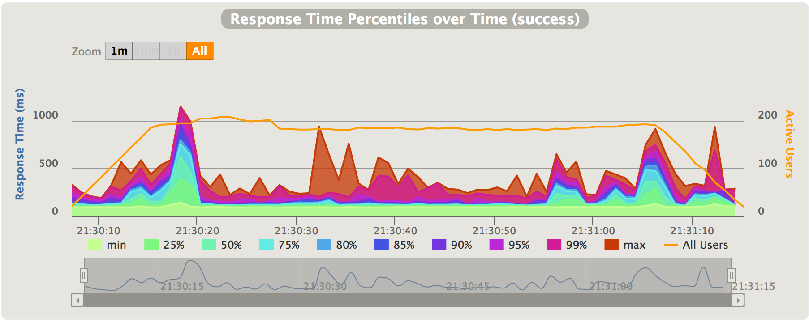
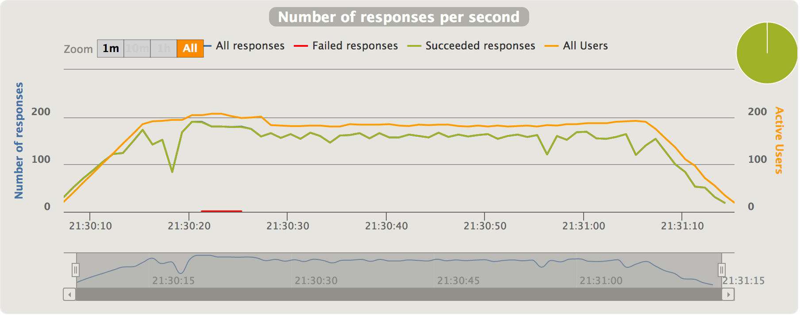

.. _reports:

#######
Reports
#######

Overview
========

Global menu points to consolidated statistics.

Details menu points to per-request-type statistics.

.. note:: Reports can be generated from the simulation.log file even if the scenario was interrupted (Ctrl+C or process killed), use the ``-ro`` option.
          See :ref:`Configuration page <gatling-cli-options>`.

Overall Simulation charts
=========================

Most of those charts are available for both the overall simulation report and for per request/group charts.

Indicators
----------

.. image:: img/reports/charts-indicators.png
    :alt: DetailsIndicators
    :scale: 70

This chart shows how response times are distributed among standard ranges.
The right panel show number of OK/KO requests.

.. note:: these ranges can be configured in the ``gatling.conf`` file.

.. image:: img/reports/charts-statistics.png
    :alt: Statistics
    :scale: 70

The top panel shows some standard statistics such as min, max, average, standard deviation and percentiles globally and per request.

.. note:: these percentiles can be configured in the ``gatling.conf`` file.

.. note:: If your scenario contains groups, this panel becomes a tree : each group is a non leaf node, and each request is a descendant leaf of a group. Group timings are by default the cumulated response times of all elements inside the group. Group duration can be displayed instead of group cumulated response time by editing the ``gatling.conf`` file.

The bottom panel shows some details on the failed requests.

Active users over time
----------------------

.. image:: img/reports/charts-users.png
    :alt: ActiveUsers
    :scale: 70

This chart displays the active users during the simulation : total and per scenario.

Response time distribution
--------------------------

.. image:: img/reports/charts-distrib.png
    :alt: ResponseTimeDistribution
    :scale: 70

This chart displays the distribution of the response times.

Response time percentiles over time
-----------------------------------

This charts displays a variety of response time percentiles over time, but only for successful requests.
As failed requests can end prematurely or be caused by timeouts, they would have a drastic effect on the percentiles computation.

Requests per second over time
-----------------------------

.. image:: img/reports/charts-requests-per-sec.png
    :alt: RequestsPerSecond
    :scale: 70

This chart displays the number of requests sent per second over time.

Responses per second over time
------------------------------

This chart displays the number of responses received per second over time : total, successes and failures.

Request/group specific charts
=============================

Those charts are only available when consulting the details for a request/group.

Response Time against Global RPS
--------------------------------

.. image:: img/reports/charts-response-time-global-rps.png
    :alt: ResponseTimeOverLoad
    :scale: 70

This chart shows how the response time for the given request is distributed, depending on the overall number of request at the same time.
