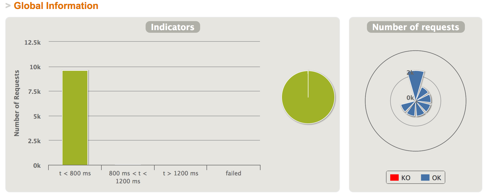
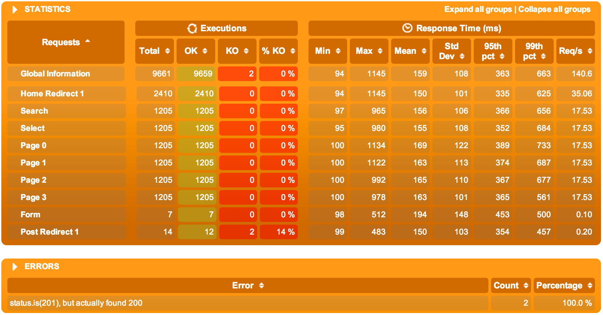
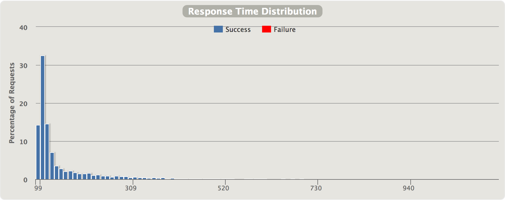
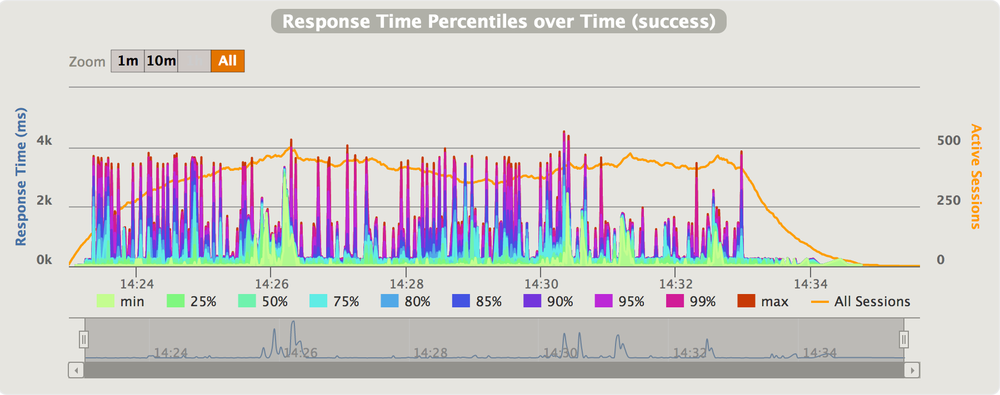
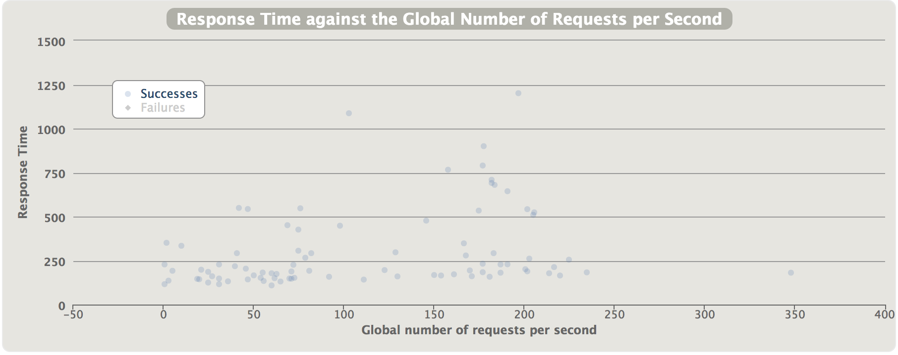
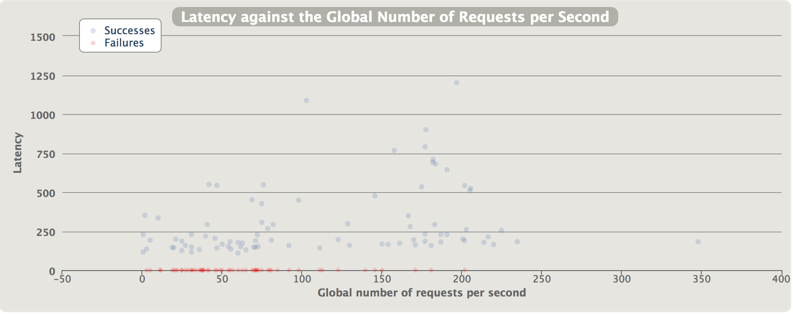

.. _reports:

#######
Reports
#######

Overview
========

Global menu points to consolidated statistics.

Details menu points to per-request-type statistics.

.. note:: Reports can be generated from the simulation.log file even if the scenario was interrupted (Ctrl+C ou process killed), use the ``-ro`` option.
          See :ref:`Configuration page <gatling-cli-options>`.

Indicators
==========

This chart shows how response times are distributed among standard ranges.
The right panel show number of OK/KO requests.

.. note:: these ranges can be configured in the ``gatling.conf`` file.

The top panel shows some standard statistics such as min, max, average, standard deviation and percentiles globally and per request.

.. note:: these percentiles can be configured in the ``gatling.conf`` file.

The bottom panel shows some details on the failed requests.

Active sessions over time
=========================

.. image:: img/reports/charts-sessions.png
	:alt: ActiveSessions
	:scale: 70

This chart displays the active users along the simulation : total and per scenario.

Response time distribution
==========================

This chart displays the distribution of the response times.

Requests per second over time
=============================

.. image:: img/reports/charts-requests-per-sec.png
	:alt: RequestsPerSecond
	:scale: 70

This chart displays the number of requests per second over time : total, successes and failures.

Total transactions per second over time
=======================================

.. image:: img/reports/charts-transactions-per-sec.png
	:alt: TransactionsPerSecond
	:scale: 70

This chart displays the number of response received per second over time : total, successes and failures.

Response Time over time
=======================

The response time is the duration between the beginning of the request emission and the end of the response reception.
This chart shows the response time distribution over time for the given request.

Latency over time
=================

.. image:: img/reports/charts-latency.png
	:alt: LatencyOverTime
	:scale: 70

The latency is the duration between the end of the request emission and the beginning of the response reception.
This chart shows the latency distribution over time for the given request.

Response Time over load
=======================

This chart shows how the response time for the given request is distributed, depending on the total load of the application at the same time.

Latency over load
=================

This chart shows how the latency for the given request is distributed, depending on the total load of the application at the same time.
