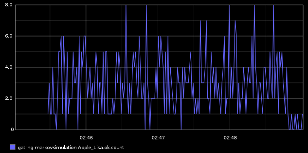

.. _graphite:

########
Graphite
########

Gatling offers a way to have some live statistics through Graphite so that you don't have to wait for the generation of the final report to see what happens.

This way, you can also monitor what happens on the client side AND the server side and collect all the data in one central repository.

Configuration
=============

Configuration of Graphite
-------------------------

In $GRAPHITE_HOME/conf/storage-schemas.conf:

::

	[Gatling stats]
	priority = 110
	pattern = ^gatling\..*
	retentions = 1s:6d,10s:60d

In $GRAPHITE_HOME/conf/storage-aggregation.conf:
::

	[sum]
	pattern = \.count$
	xFilesFactor = 0
	aggregationMethod = sum

	[min]
	pattern = \.min$
	xFilesFactor = 0.1
	aggregationMethod = min

	[max]
	pattern = \.max$
	xFilesFactor = 0.1
	aggregationMethod = max

	[default_average]
	pattern = .*
	xFilesFactor = 0.3
	aggregationMethod = average

Configuration of Gatling
------------------------

In $GATLING_HOME/conf/gatling.conf, be sure to :

* have the GraphiteDataWriter in the list of writers
* have the correct host and port for Graphite

::

	data {
	  writers = "console, file, graphite"
	  reader = file
	}
	graphite {
			host = "192.168.56.101"
			port = 2003
			#light = false							  # only send the all* stats
			#protocol = "tcp" 						# Choose between 'tcp' or 'udp'
			#rootPathPrefix = "gatling"
			#bucketWidth = 100
			#bufferSize = 8192
		}

As you can see above there is a bunch of other properties that you can set:

* **light**: If set to true, Gatling will send only all* stats.
* **protocol**: Set protocol to send data: TCP(default) or UDP.
* **bucketWidth**: Set the size in ms of the buckets to compute percentiles.
* **bufferSize**: Set the size of the TCP output buffer.

Metrics
=======

Two types of metrics are provided by Gatling  :
 * Users metrics
 * Requests metrics

Gatling pushes those data to Graphite every second.

User metrics
------------

Users metrics give you, for each scenario of your simulation (or all scenarios using *allUsers*) :
 * *waiting* : # of users waiting to start the scenario
 * *active* : # of users currently running the scenario
 * *done* : # of users who have completed the scenario

The metric path for users metrics is *gatling.scenarioName.users.metric*, where :
 * **scenarioName** is the name of your scenario
 * **metric** is one of the metrics described above

Request metrics
---------------

Requests metrics give you, for each request (or all requests using _allRequests_) and by status (OK, KO and both) :
 * *count* : requests/sec
 * *min* and *max* : Min and Max response time for the request
 * *percentilesXX* :  First and second percentiles, as defined in gatling.conf (defaults are 95th and 99th percentiles)

The metric path for requests metrics is *gatling.scenarioName.requestName.status.metric*, where :
 * **scenarioName** is the name of your scenario
 * **requestName** is the name of your request
 * **status** is either *ok* (for successful requests), *ko* (for failed requests) or *all* (for both successful and failed requests)
 * **metric** is one of the metrics described above

Examples
========

All the following charts have been done with this line mode : ``Graph Options\Line Mode\Connected Line``

Graphing the ``.max`` is usally a good start to monitor a given request.

.. image:: img/max.png
	:alt: MaxEvolution

One may be interested in monitoring the number of requests per second with ``.count``.

One can easily graph the total number of requests executed thanks to the Graphite ``integral()`` function.

.. image:: img/count_integral.png
	:alt: CountTotal