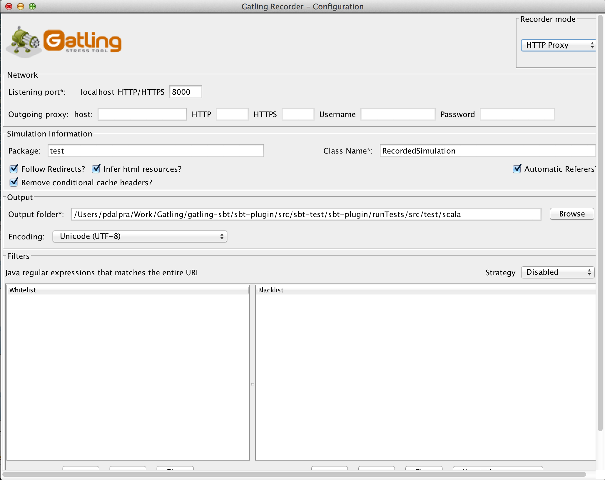
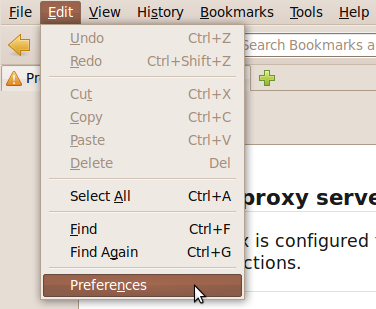
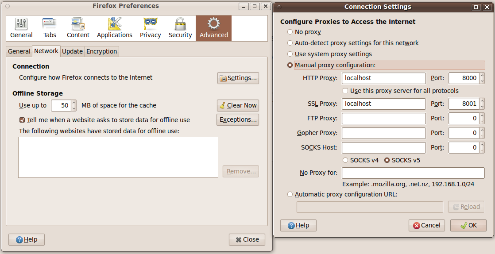

########
Recorder
########

The Gatling Recorder helps you to quickly generate scenarios. It acts as a HTTP proxy between the browser and the HTTP server. While you navigate through the application, it records all HTTP exchange and when done, generates the scenario simulating what you just did.

Launch it from the bundle with the following script ``$GATLING_HOME/bin/recorder.sh``.
You will get a window that looks like this one:

Configuration
=============

Local proxy ports
-----------------

In the Recorder, you have to define two ports: one for listening to HTTP traffic and one for HTTPS traffic. Then, you have to configure your browser to use the definied ports.

Here is how to do with Firefox, open the browser settings:

Then, update the connection settings:

.. note:: HTTPS port isn't mandatory if you don't plan to use an HTTPS connection.

Outgoing proxy
--------------

If you must access your web application through a proxy, you can set it up in this section. As the configuration of local ports, two different ports can be defined for the outgoing proxy (HTTP & HTTPS).

.. note:: If HTTP and HTTPS are on the same port for the outgoing proxy, you need to explicitly specify both.

Filters
-------

TODO

Embedded resources fetching
---------------------------

If you check the option 'Fetch html resources?' option, the Recorder will fetch the embedded HTML resources as follow:

* Add ``fetchHtmlResources`` with the proper white/black lists on the HTTP protocol definition.
* Parse HTML response body to retrieve embedded HTML resources.
* Filter requests corresponding to embedded HTML resources from resulting ``Scenario``.

.. warning:: Gatling can't retrieve all the embedded resources in HTML as images embedded in a css embedded in HTML.
             This remaining resources are currently loaded sequentially as regular requests.

Running
=======

Once everything has been configured, press the **Start** button to launch the recorder.

Recorded Events
---------------

As you navigate through your application, the recorder will log three kinds of events:

* **Requests**: The requests sent by the browser.
* **Pauses**: The time between each request.
* **Tags**: Manually set markers.

Tag Events
----------

To make your scenario more understandable, you can add tags, they will appear as comments in the scenario: ``/* my tag */``

To add a tag, fill in the text field provided and press the **Add** button. After that, the tag will be displayed in the list below.

For example: ``TAG | my tag``

Stop
----

When you have finished recording your scenario, press the **Stop** button to save it in the format defined in the configuration.

HAR Files
=========

You can import a HAR file (Http Archive) into the Recorder and convert it to a Gatling simulation. HAR files can be obtained using the Chrome Developer Tools or with Firebug and the NetExport Firebug extension. To import a HAR file, select the *HAR converter* mode in the top right dropdown in the Recorder.

Command-line options
====================

For those who prefer the command line, command line options can be passed to the gatling-recorder:

* ``-lp``: Local port (alias = ``--local-port``)
* ``-lps``: Local SSL port (alias = ``--local-port-ssl``)
* ``-ph``: Outgoing proxy host (alias = ``--proxy-host``)
* ``-pp``: Outgoing proxy port (alias = ``--proxy-port``)
* ``-pps``: Outgoing proxy SSL port (alias = ``--proxy-port-ssl``)
* ``-of``: Output folder for results (alias = ``--output-folder``)
* ``-rbf``: Folder for requests bodies (alias = ``--request-bodies-folder``)
* ``-cn``: Name of the generated class (alias = ``--class-name``)
* ``-pkg``: Package of the generated class (alias = ``--package``)
* ``-enc``: Encoding used in the Recorder (alias = ``--encoding``)
* ``-fr``: Enable *Follow Redirects* (alias = ``--follow-redirect``)

.. note:: Command-line options override saved preferences.
