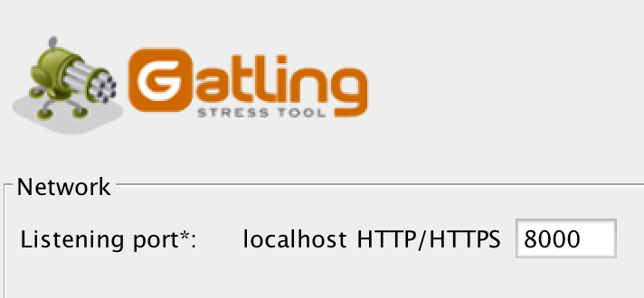

.. _recorder:

########
Recorder
########

The Gatling Recorder helps you to quickly generate scenarios, by either acting as a HTTP proxy between the browser and the HTTP server or converting HAR (Http ARchive) files.
Either way, the Recorder generates a simple simulation that mimics your recorded navigation.

If you're using the bundle, you can launch it with the following script ``$GATLING_HOME/bin/recorder.sh``.
You will get a window that looks like this one:

.. image:: img/recorder.png

.. _recorder-config:

Configuration
=============

.. _recorder-port:

Listening proxy port
--------------------

In the Recorder, you have to define one port (for both HTTP and HTTPS): the local proxy port. This is the port your browser must connect to so that the Recorder is able to capture your navigation.

Then, you have to configure your browser to use the defined port.

Here is how to do with Firefox, open the browser Advanced settings, then go to the Network panel and update the connection settings:

.. image:: img/recorder-browser_advanced_settings.png

.. _recorder-https:

HTTPS mode
----------

On the contrary to regular proxies that act as a pass-though, the recorder acts as a man-in-the-middle and decrypt your HTTPS traffic.
The consequence is that it's identified by browsers as a security threat, so, one way or the other, you have to tell your browser that everything is fine.

The Recorder has 3 modes:

* Self-signed certificate (historical default)

The recorder will use the same self-signed certificate for every domain.
Browsers will prompt a security alert, and ask you if you want to add a security exception for this domain.
If it doesn't do so, it means that you've already registered a validated (by a standard Certificate Authority) certificate and it refuses to replace it by a less secured one.
You then have to remove it from your certificate registry.

.. warning:: Browsers will only prompt a security alert for the page domain, not for resource ones (typically, CDNs).
             The Recorder will list all such domains, you'll then have to directly visit every one of them and add a security exception for each.

* Provided KeyStore

One can pass a full Java keyStore (JKS or PKCS#12 format) that contains the certificate to be used.
This mode is useful if you have already generated a Java keystore for your application and want to reuse it for recording.

* On-the-fly certificate generation

This mode takes a Certificate Authority (certificate and private key, in PEM format) and generates signed certificates for every visited domain.

You can either ask Gatling to generate those files for you, or provide a CA of your own.

.. note:: If you're not using the self-signed certificate, you'll have to import the Certificate Authority certificate into your browser's keystore:

* under desktop Chrome, go in HTTPS/SSL settings, Manage Certificates
* under desktop Firefox, go in Advanced settings, Certificates, Display, Authorities, Import
* on OSX for iPhone, IPad, you simply have to send you the certificate file by email, and then open the attached file
* on Android, check `official documentation <https://support.google.com/nexus/answer/2844832?hl=en>`_.

.. _recorder-proxy:

Outgoing proxy
--------------

If you must access your web application through a proxy, you can set it up in this section. Two different ports can be defined for the outgoing proxy (HTTP & HTTPS).

.. note:: Even if HTTP and HTTPS are on the same port for the outgoing proxy, you need to explicitly specify both.

.. _recorder-filters:

Filters
-------

Allow you to filter out some requests you don't want to record. For example, if you don't want to record any CSS files, you can add in the blacklist section the following Java regex ``.*\\.css``.

The order of evaluation between the whitelist and the blacklist entries can be determined with the *strategy* setting. You can either evaluate the whitelist or the blacklist first.

.. _recorder-fetch:

Embedded resources fetching
---------------------------

If you check the 'Infer html resources?' option, the Recorder will fetch the embedded HTML resources as follow:

* Add ``inferHtmlResources`` with the proper white/black lists on the HTTP protocol definition.
* Parse HTML response body to retrieve embedded HTML resources.
* Filter requests corresponding to embedded HTML resources from resulting ``Scenario``.

.. warning:: Gatling can't retrieve all the embedded resources in HTML as images embedded in a css embedded in HTML.
             This remaining resources are currently loaded sequentially as regular requests.

.. _recorder-request-naming:

HTTP request naming
--------------------------------
By default gatling will use the prefix ``request_`` for recorded and converted http requests.
When the 'Use class name as request prefix?' option is enabled, http requests will use the
simulation class as prefix for the request name instead.

.. _recorder-response-bodies:

Response bodies
---------------

When the 'Save & check response bodies?' option is enabled, response bodies will be dumped in the same folder as the request bodies, and the simulation will contain extra checks using :ref:`RawFileBody <http-request-body-rawfile>` to ensure the actual bodies are matching the dumped ones. You might want to edit these checks, for example to parametrize the expected bodies, using :ref:`ElFileBody <http-request-body-elfile>` instead.

.. _recorder-run:

Running
=======

Once everything has been configured, press the **Start** button to launch the recorder.

.. _recorder-events:

Recorded Events
---------------

As you navigate through your application, the recorder will log three kinds of events:

* **Requests**: The requests sent by the browser.
* **Pauses**: The time between each request.
* **Tags**: Manually set markers.

.. _recorder-tags:

Tag Events
----------

To make your scenario more understandable, you can add tags, they will appear as comments in the scenario: ``/* my tag */``

To add a tag, fill in the text field provided and press the **Add** button. After that, the tag will be displayed in the list below.

For example: ``TAG | my tag``

.. _recorder-stop:

Stop
----

When you have finished recording your scenario, press the **Stop** button to save it in the format defined in the configuration.

.. _recorder-har:

HAR Files
=========

You can import a HAR file (Http Archive) into the Recorder and convert it to a Gatling simulation.

HAR files can be obtained using the Chrome Developer Tools or with Firebug and the NetExport Firebug extension.

With Chrome Developer Tools, go to *Network* tab, and make sure you've selected the *Preserve log* checkbox, otherwise the log is reset when you change page.
Select the requests you want to export, then right click and select *Copy All as HAR* and save what's in your clipboard into a file.

Please don't use `Charles Proxy <http://www.charlesproxy.com>`__ for this.
Charles is an amazing tool and has an HAR export feature, but it's a proxy, so when you use it, you change the HTTP behavior, and the HAR would contain requests that should be here, such as CONNECTs.

To import a HAR file, select the *HAR converter* mode in the top right dropdown in the Recorder.

.. _recorder-headless:

Headless mode
=============

Along the GUI mode, Gatling also offers a simple CLI interface, facilitating the automation of recording or converting simulations from HAR files.
The Headless mode can be enabled either from the ``recorder.conf`` file or with the ``-cli``/``--headless`` command line option.
Both 'Proxy' and 'HAR' modes are supported (you can set which mode to use using the ``-m``/``--mode`` command line option).

Proxy
-----

In 'Proxy mode', the Recorder will start listening for requests from your browser right away.
To stop the Recorder and create the Simulation, you have to 'kill' the Recorder by either:

* Sending a 'kill' signal with ``CTRL-C``
* Killing the Recorder's process, using the Recorder process ID written to the ``.gatling-recorder-pid`` file: ``cat .gatling-recorder-pid | xargs kill``

HAR Converter
-------------

In 'Har' mode, the Recorder will convert the provided HAR file to a Simulation and exits.

.. _recorder-cli:

Command-line options
====================

For those who prefer the command line, command line options can be passed to the Recorder:

+--------------------+-------------------------------------+------------------------------------------+
| Option (short)     | Option (long)                       | Description                              |
+====================+=====================================+==========================================+
| -lp <port>         | --local-port <port>                 | Local Proxy HTTP/HTTPS port              |
+--------------------+-------------------------------------+------------------------------------------+
| -ph <port>         | --proxy-host <port>                 | Outgoing proxy host                      |
+--------------------+-------------------------------------+------------------------------------------+
| -pp <port>         | --proxy-port <port>                 | Outgoing proxy port                      |
+--------------------+-------------------------------------+------------------------------------------+
| -pps <port>        | --proxy-port-ssl <port>             | Outgoing proxy SSL port                  |
+--------------------+-------------------------------------+------------------------------------------+
| -sf <path>         | --simulations-folder <path>         | Output folder for generated simulations  |
+--------------------+-------------------------------------+------------------------------------------+
| -rf <path>         | --resources-folder <path>           | Output folder for generated resources    |
+--------------------+-------------------------------------+------------------------------------------+
| -cn <className>    | --class-name <className>            | Name of the generated simulation         |
+--------------------+-------------------------------------+------------------------------------------+
| -pkg <packageName> | --package <packageName>             | Package of the generated simulation      |
+--------------------+-------------------------------------+------------------------------------------+
| -enc <encoding>    | --encoding <encoding>               | Encoding used in the Recorder            |
+--------------------+-------------------------------------+------------------------------------------+
| -fr <true|false>   | --follow-redirect <true|false>      | Enable *Follow Redirects*                |
+--------------------+-------------------------------------+------------------------------------------+
| -ar <true|false>   | --automatic-referer <true|false>    | Enable *Automatic Referers*              |
+--------------------+-------------------------------------+------------------------------------------+
| -fhr <true|false>  | --fetch-html-resources <true|false> | Enable *Fetch html resources*            |
+--------------------+-------------------------------------+------------------------------------------+
| -m <Proxy|Har>     | --mode <Proxy|Har>                  | Recorder mode to use                     |
+--------------------+-------------------------------------+------------------------------------------+
| -cli <true|false>  | --headless <true|false>             | Run Recorder in headless mode            |
+--------------------+-------------------------------------+------------------------------------------+
| -hf <path>         | --har-file <path>                   | The HAR file to convert (if mode is Har) |
+--------------------+-------------------------------------+------------------------------------------+

.. note:: Command-line options override saved preferences.

System properties
=================

There are 2 system properties to control the use of a custom certificate keystore for the proxy:

* ``gatling.recorder.keystore.path``
* ``gatling.recorder.keystore.passphrase``

