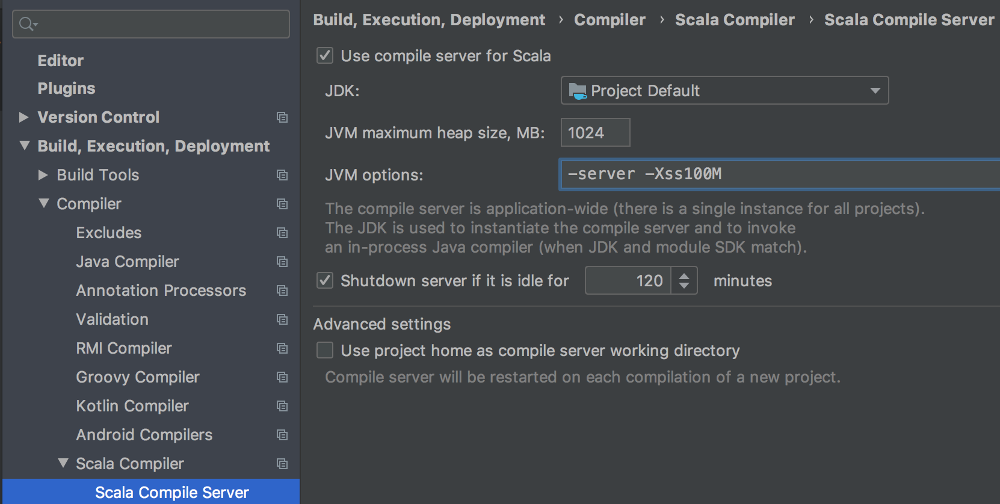

.. _installation:

############
Installation
############

Prerequisites
=============

.. _prerequisite_java:

Java Version
------------

Gatling supports 64bits OpenJDK 8 and OpenJDK 11 with HotSpot.
Other JVMs such as JDK 12+, client JVMs, 32bits systems or OpenJ9 are not supported.

.. _prerequisite_scala:

Scala Version
-------------

Since 3.0, Gatling requires Scala 2.12.
Gatling is not compatible with Scala 2.11 nor Scala 2.13.

.. _gatling_version:

Gatling Version
---------------

Make sure to use the latest version as documented on `our website <https://gatling.io/open-source/>`_.

In particular, don't use milestones (M versions) you could find on maven central,
those are not documented and released only for internal use or `FrontLine <https://gatling.io/gatling-frontline/>`_ customers.

.. _bundle:

Using the Bundle
================

You can use Gatling as a standalone bundle.
Then, you'll just need a text editor, possibly with Scala syntactic coloration, to edit your simulations
and you'll be able to launch Gatling from the command line.

Check out our `Open Source page </open-source/>`__ for the download link.

Unzip the downloaded bundle to a folder of your choice.
Use the scripts located in the ``bin`` directory for launching Gatling and the Recorder.

.. warning::
Windows users : we recommend that you do not place Gatling in the *Programs* folder as there may be permission and path issues.

In order to run Gatling, you need to have a JDK installed.
Gatling requires at least **JDK8**. Then, we recommend that you use an up-to-date version.

For all details regarding the installation and the tuning of the operating system (OS), please refer to the :ref:`operations` section.

.. warning::
Gatling launch scripts and Gatling maven plugin honor ``JAVA_HOME`` env var if it's set.
  OS, like OSX, have their own tricky way of discovering which version of Java to run,
  so you might end up running a different version than the one ``java -version`` tells you.
  If you get strange errors such as ``Unsupported major.minor version 51.0`` and you were expecting to run a JDK8,
  you might want to explicitly set ``JAVA_HOME``.

Using a Build Tool
==================

Maven
-----

Gatling provides an official maven plugin named `gatling-maven-plugin`. This plugin lets you compile your Scala code and launch Gatling simulations.

Check the :ref:`maven plugin documentation <maven-plugin>` for more information.

Sbt
---

Gatling provides an official sbt plugin named `gatling-sbt`. This plugin lets you launch your Gatling simulations.

Check the :ref:`sbt plugin documentation <sbt-plugin>` for more information.

Gradle
------

Gatling provides an official gradle plugin named `io.gatling.gradle`. This plugin lets you launch your Gatling simulations.

Check the :ref:`gradle plugin documentation <gradle-plugin>` for more information.

.. _ide:

Using an IDE
============

You can edit your Simulation classes with any text editor, maybe with some syntactic coloration for Scala.
But if you are a developer, you'll most likely want to use your favorite IDE with Gatling.

Gatling officially supports IntelliJ IDEA and eclipse.

.. _intellij:

IntelliJ IDEA
-------------

You'll need to install the Scala plugin, which is available in the Community Edition.
You'll then be able to directly import regular maven or sbt projects with Scala sources out of the box.

You'll most likely have to increase the stack size for the scala compiler so you don't suffer from StackOverflowErrors.
We recommend setting ``Xss`` to ``100M``.

.. _eclipse:

Eclipse
-------

You'll have to install `ScalaIDE <http://scala-ide.org/index.html>`__, preferably the latest version, even a milestone.

Sadly, as of today, ScalaIDE is only available for Eclipse 4.7 (Oxygen) and is not compatible with more modern versions.

Note that Eclipse 4.7 doesn't support Java 9+, so if you have multiple Java installations on your machine, you might have to force the JVM used in ``eclipse.ini``, eg::

  -vm
  /Library/Java/JavaVirtualMachines/jdk1.8.0_222.jdk/Contents/Home/bin/java

Moreover, if you're using maven, you'll need to install `m2eclipse-scala <https://github.com/sonatype/m2eclipse-scala>`_ to integrate ScalaIDE and m2e (the eclipse plugin for maven).

With sbt
^^^^^^^^

If you're using sbt, you can use `sbteclipse <https://github.com/sbt/sbteclipse>`_ to generate the eclipse project config.

With maven
^^^^^^^^^^

.. highlight:: xml

If you're using maven, you can use the `scala-maven-plugin <https://github.com/davidB/scala-maven-plugin>`_ for compiling Scala code.

You'll have to add the following section in your `pom.xml`::

  <build>
    <sourceDirectory>src/main/scala</sourceDirectory>
    <testSourceDirectory>src/test/scala</testSourceDirectory>
    <plugins>
      <plugin>
        <groupId>net.alchim31.maven</groupId>
        <artifactId>scala-maven-plugin</artifactId>
        <version>MANUALLY_REPLACE_WITH_LATEST_VERSION</version>
        <configuration>
           <jvmArgs>
            <jvmArg>-Xss100M</jvmArg>
          </jvmArgs>
          <args>
            <arg>-target:jvm-1.8</arg>
            <arg>-deprecation</arg>
            <arg>-feature</arg>
            <arg>-unchecked</arg>
            <arg>-language:implicitConversions</arg>
            <arg>-language:postfixOps</arg>
          </args>
        </configuration>
        <executions>
          <execution>
            <goals>
              <goal>compile</goal>
              <goal>testCompile</goal>
            </goals>
          </execution>
        </executions>
      </plugin>
    </plugins>
  </build>

.. _launchers:

Launching Gatling and the Recorder from the IDE
-----------------------------------------------

The :ref:`gatling-highcharts-maven-archetype <maven-archetype>` generates some helper classes that you can use to launch Gatling and the Recorder manually from your IDE.
You can perfectly copy `those 3 classes <https://github.com/gatling/gatling-highcharts-maven-archetype/tree/master/src/main/scala>`_ (``Engine``, ``Recorder`` and ``IDEPathHelper``) in your own project.

Please check the :ref:`launchers documentation section <launchers>`.
