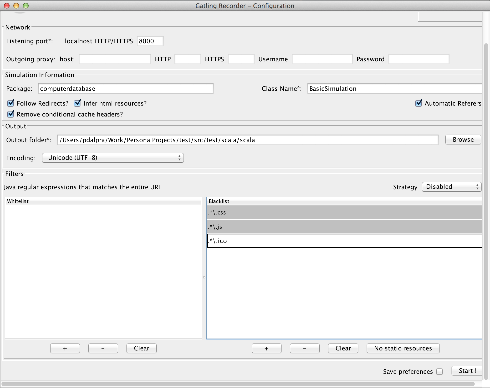

.. _quickstart:

##########
Quickstart
##########

In this section we will use Gatling to load test a simple cloud hosted web server and will introduce you to the basic elements of the DSL.
Altough we consider it possible to use the DSL without much `Scala <http://www.scala-lang.org/>`_ knowledge, we may recommand to have a quick look at `Scala School <http://twitter.github.io/scala_school>`_.

Getting Gatling
===============

You can get Gatling bundles as a .tar.gz or .zip file `here <https://github.com/excilys/gatling/wiki/Downloads>`_.

Requirements
============

Gatling 2 is compiled with JDK7, yet into JDK6 bytecode.

Yet, we recommend that you use the latest JDK7. NIO is based on native code, so it depends on JVM implementation and bugs are frequently fixed. For example, NIO have been broken on Oracle JDK7 until 1.7.0_10. Gatling is mostly tested on Oracle JDK7, OS X and Linux.

Installing Gatling
==================

Just unzip the downloaded bundle to a folder of your choice.

    X-platform users:
        Don't use a path with spaces in it.

    Windows users:
        We recommend that you do not put Gatling in Programs folder as there might be permission issues.

Configure your OS
=================

You might first want to have a look at how to tune Gatling and your OS according to your use case.

A word on encoding
==================

Gatling uses by default UTF-8. If you want to use a different one, you have to:

  * Select the proper encoding in the Recorder
  * Configure the proper encoding in the gatling.conf file. This is the one that will be used for compiling your simulations and building your requests.
  * Make sure your text editor is properly configured and doesn't change the original encoding.

Running Gatling
===============

Gatling offers a command line interface (CLI) that can be run using the following command::

  ~$ $GATLING_HOME/bin/gatling.sh

Windows users:
    you can double click on the gatling.bat file located in GATLING_HOME/bin

Once executed, you should see a menu with the simulation examples::

  Choose a simulation number:
     [0] computerdatabase.Simulation
  Invalid characters, please provide a correct simulation number:

To run a simulation, simply type the number of the simulation you want to run, choose a name for the folder where the results will be generated, and a description for the run.

And... voila!

  Note: If Gatling does not work as expected, see our FAQ.

Your first simulation!
======================

Here you are, waiting to know all about Gatling and all its secrets to achieve incredibly powerful performance testing.

This page will guide you through most of the features.
You'll learn about simulations, scenarios, feeders, recorder, loops, scala functions, etc.
But don't worry, this won't be painful, we'll take care of you during this journey through the amazing Gatling!

Our mission during these two pages will be to test the computer database scala sample provided with Play 2 distribution and hosted on Heroku.
We will first decide what scenario we want to create, then, we'll create it thanks to the Gatling Recorder and run it to see how the application behaved during the performance test.

You're going to see some Scala, but don't panic!
================================================

Yes, the Gatling simulation scripts are Scala classes.

No, it won't be painful, Gatling doesn't expect you to be a hardcore Scala hacker, but just to read this manual so you can learn the DSL.

However, once in a while, you might run into a specific use case that's not supported out of the box and then want to write your own components.
If you write complex simulations, you might want to split them into multiple classes/objects.
In this case, you can :

  * Learn Scala. One very good starting point is `Twitter's Scala School <http://twitter.github.io/scala_school/>`_.
  * Join the Google Group and ask for help.

Anyway, the Gatling DSL should suffice for most current needs.

For the non Scala people, here's what a Gatling simulation class look like::

  package foo.bar (1)

  import io.gatling.core.Predef._ (2)
  import io.gatling.http.Predef._
  import scala.concurrent.duration._

  class SimulationWithFollowRedirect extends Simulation { (3)

    // your code starts here
    val scn = scenario("My scenario")
            .exec(http("My Page")
              .get("http://mywebsite.com/page.html")) (4)

    setUp(scn.inject(atOnce(10 users)) (5)
    // your code ends here
  }

Let's explain :

  1. The optional package.
  2. The required imports.
  3. The class declaration. Note that your simulation extends ``Simulation``.
  4. Your scenario definition. ``val`` is the keyword for defining a non-re-assignable value.
  5. The list of the scenarios declared in the class.

The application under test
==========================

In this tutorial, you'll be playing with an application named 'computer-database' deployed on Heroku at the following url:

http://computer-database.heroku.com/

This is a simple CRUD application for managing computer models. The main features available are:

  * Creation / Edition / Visualization of computer models
  * Searching / Sorting / Paginating computer models

Planning the test
=================

To test the performance of this application, we'd like to create scenarios representative of what really happens when users navigate it.
So we tried to imagine what a real user would do with our application, shrank it and we got the following:

  * The user opens the application.
  * The user searches for 'macbook'.
  * The user opens one of the related model.
  * The user goes back to home page.
  * The user iterates through pages.
  * The user creates a new model.

Now that we have decided what would be the common use of our application, we can create the scenario for Gatling.

Gatling Recorder
================

To ease the creation of scenarios, we will use the Recorder, a tool provided with Gatling that allows you to record your actions on a web application and export them as Gatling scenarios.

This tool is launched with a script located in the bin directory along the gatling one::

  ~$ $GATLING_HOME/bin/recorder.sh

Configuration
-------------

Once launched, you get the following GUI, which lets use configure how requests and response will be recorded:

Set up Gatling Recorder with the following options:

  * ``/**/*.css``, ``/**/*.js`` and ``/**/*.ico`` filters.
  * ``Follow Redirects?`` checked.
  * ``Automatic Referers`` checked
  * ``computerdatabase`` package

After configuring the recorder, all you have to do is to start it and configure your browser to use Gatling Recorder's proxy.

  For information about how to configure your browser, you can check out the Recorder's documentation.

Recording the scenario
----------------------

All you have to do now is to browse the application:

  1. Go to the website: http://computer-database.heroku.com/
  2. Search for models with 'macbook' in their name.
  3. Open one of the matching model by clicking on it name.
  4. Go back to home page.
  5. Iterates through the model pages by clicking on ``Next`` button.
  6. Create a new computer model:

    * Click on ``Add new computer``.
    * Fill the form.
    * Click on ``Create this computer``

  Try to act as a user, don't jump from one page to another without taking the time to read.
  This will make your scenario closer to real user behavior.

When you have finished to play the scenario, you can click on Stop, and your first Gatling scenario will be created by the recorder.
Its name will be ``SimulationYYYYMMDDHHMMSS.scala``

The Gatling scenario corresponding to our example is available in the folder ``user-files/simulations/computerdatabase`` of your Gatling installation under the name ``BasicSimulation.scala``.

Gatling scenario explained
==========================

So now you've got a file with some mysterious dialect written in it.
Nice! but... what does this mean? Don't worry, we are going to decrypt these bizarre words for you :-)

This file is a real Scala class containing 4 different parts:

  * The HTTP protocol configuration
  * The headers definition
  * The scenario definition
  * The simulation definition

Fore more details see `here <simulation_structure>`_.

Go further with Gatling
=======================

Now we have a basic Simulation to work with, we will apply a suite of refactoring to introduce more advanced concepts and DSL constructs.

The resulting simulations are available in the folder ``user-files/simulations/computerdatabase/advanced/``.

Step 01: Bring order into this mess
-----------------------------------

Presently our Simulation is a bit messy, we have a big scenario without real business meaning.
So first let split it in composable business processes, like one would do with PageObject pattern with Selenium.
This will ease the writing of various scenarios by user population.

In our scenario we have three separated processes:

  * Search: search models by name
  * Browse: browse the list of models
  * Edit: edit a given model

So we will create three Scala objects, objects are native Scala singletons, to encapsulate these processes::

  object Search {

    val search = exec(http("Home") // let's give proper names, they are displayed in the reports, and used as keys
        .get("/"))
      .pause(7)
      .exec(http("Search")
        .get("/computers")
        .queryParam("""f""", """macbook"""))
      .pause(2)
        .exec(http("Select")
        .get("/computers/6"))
      .pause(3)
  }

  object Browse {

    val browse = ...
  }

  object Edit {

    val edit = ...
  }

We can now rewrite our scenario using these reusable business processes::

   val scn = scenario("Scenario Name").exec(Search.search, Browse.browse, Edit.edit)

Step 02: More users = more load!
--------------------------------

So, this is great, we can load test our server with... one user!
We are going to increase the number of users.

Let define two populations of users:

  * The regular users: they can search and browse computer models.
  * The admin users: they can search, browse and edit computer models.

Translating into scenario this gives::

  val users = scenario("Users").exec(Search.search, Browse.browse)
  val admins = scenario("Admins").exec(Search.search, Browse.browse, Edit.edit)

To increase the number of simulated users, all you have to do is to change the configuration of the simulation as follows::

  setUp(users.inject(atOnceUsers(10)).protocols(httpConf))

  Note: Here we set only 10 users, because we don't want to flood our test web application, please be kind and don't crash our Heroku instance ;-)

If you want to simulate 3 000 users, you don't want them to start at the same time.
Indeed, they are more likely to connect to your web application gradually.

Gatling provides the ``rampUsers`` builtin to implement this behavior.
The value of the ramp indicates the duration over which the users will be linearly started.

In our scenario let's have 10 regular users and 2 admins, and ramp them on 10 sec so we don't hammer the server::

  setUp(
    users.inject(rampUsers(10) over (10 seconds)),
    admins.inject(rampUsers(2) over (10 seconds))
  ).protocols(httpConf)

Step 03: Dynamic values with Feeders
------------------------------------

We have set our simulation to run a bunch of users, but they all search for the same model.
Wouldn't it be nice if every user could search a different model name?

We need dynamic data so that all users don't play the same and we end up with a behavior completely different from the live system (caching, JIT...).
This is where Feeders will be useful.

Feeders are data sources containing all the values you want to use in your scenarios.
There are several types of Feeders, the simpliest being the CSV Feeder: this is the one we will use in our test.
Feeders are explained in details in the Feeders reference.

Here are the feeder we use and the modifications we made to our scenario::

  object Search {

    val feeder = csv("search.csv").random (1) (2)

    val search = exec(http("Home")
      .get("/"))
      .pause(1)
      .feed(feeder) (3)
      .exec(http("Search")
        .get("/computers")
        .queryParam("""f""", "${searchCriterion}") (4)
        .check(regex("""<a href="([^"]+)">${searchComputerName}</a>""").saveAs("computerURL"))) (5)
      .pause(1)
      .exec(http("Select")
        .get("${computerURL}") (6)
        .check(status.is(200)))
      .pause(1)
  }

Let's explain :

  1. First we create a feeder from a csv file with the following columns : ``searchCriterion``, ``searchComputerName``.
  2. The default feeder is a queue, so for this test, we use a random one to avoid feeder starvation.
  3. Every time a user passes here, a record is popped from the feeder and injected into the user's session.
     Thus user has two new session data named ``searchCriterion``, ``searchComputerName``.
  4. We use session data using Gatling's EL to parametrized the search.
  5. We use a regex with an EL, to capture a part of the HTML response, here an hyperlink, and save it in the user session with the name ``computerURL``.
  6. We use the previously save hyperlink to get a specific page.

Step 04: Don't repeat yourself!
-------------------------------

In the ``browse`` process we have a lot of repetition when iterating through the pages.
We have four time the same request with a different query param value. Can we try to DRY this ?

First we will extract the repeated ``exec`` block in a function, yes ``Simulation`` are plain Scala so we can use all the power of the language if needed::

  def gotoPage(page: String) = exec(http("Page " + page)
    .get("/computers")
    .queryParam("""p""", page))
    .pause(1)

We can now call this function and pass the desired page number.
But we have still repetition, it's time to introduce a new builtin structure::

  def gotoUntil(max: String) = repeat(max.toInt, "i") { (1)
    gotoPage("${i}") (2)
  }

Let's explained:

  1. The ``repeat`` builtin is a loop resolved at RUNTIME, it take the number of repetition and optionally the name of the counter.
  2. As we force the counter name we can use it in Gatling EL and access the nth page.

And finally we can write the ``browse`` process as follow::

  val browse = gotoUntil("4")

Step 05: Check and failure management
-------------------------------------

Until now we use ``check`` to extract some data from the html response and store it in session.
But ``check`` are also handy to check some properties of the http response.
By default Gatling check if the http response status is 200x.

To demonstrate the failure management we will introduce a ``check`` on a condition that fails randomly::

  val random = ThreadLocalRandom.current() (1)
  val edit = exec(http("Form")
      .get("/computers/new"))
    .pause(1)
    .exec(http("Post")
      .post("/computers")
      ...
      .check(status.is(session => 200 + random.nextInt(2)))) (2)

Let's explained:

  1. First we create a thread local random number generator to avoid contention.
  2. We do a check on a condition that's been customized with a lambda.
     It will be evaluated every time a user executes the request.
     As response status is 200 the check will fail randomly.

To handle this random failure we use the ``tryMax`` and ``exitHereIfFailed`` constructs as follow::

  val edit = tryMax(2) { (1)
    exec(...)
  }.exitHereIfFailed (2)

Let's explained:

  1. ``tryMax`` allow to try a fix number of time an ``exec`` block in case of failure.
     Here we try at max 2 times the block.
  2. If the chain didn't finally succeed, the user exit the whole scenario due to ``exitHereIfFailed``.

That's all Folks!

