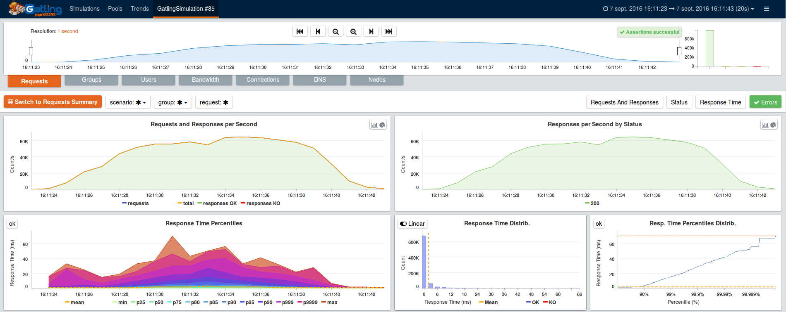

.. _realtime_monitoring:

###################
Realtime monitoring
###################

Introduction
============

By default, Gatling only provides live feedback in the console output, and generates static HTML reports.

FrontLine
=========

`FrontLine <https://gatling.io/gatling-frontline/>`__ is a commercial product from GatlingCorp, the company behind Gatling.

Amongst other features like clustering support, MQTT support, advanced integration with CI tools (Jenkins, TeamCity and Bamboo) and with Grafana,
FrontLine offers entreprise-grade realtime monitoring and metrics persistence.

For more information, please get in touch at **contact@gatling.io**.

Graphite-InfluxDB-Grafana
=========================

Gatling can provide live metrics via the Graphite protocol which can be
persisted and visualised.

The sections below describe how to configure Gatling with InfluxDB and
Graphite, and use Grafana as a graphing library. We also present a lo-fi solution
which prints parsed Graphite data to standard out. 

Gatling 
-------

In the ``gatling.conf`` add "graphite" to the data writers and specify the host
of the Carbon or InfluxDB server.

:: 
  gatling {
    data {
      writers = [console, file, graphite]
      
      graphite {
        host = "192.0.2.235"  # InfluxDB or Carbon server
        port = 2003           # The port to which the Carbon server listens to (2003 is default for plaintext, 2004 is default for pickle)
        # writePeriod = 1     # Default write interval of one second
      }
    }
  }

InfluxDB
--------

InfluxDB is one of the new crop of time-series databases [#f1]_. It is
self-contained, easy-to-install and resource efficient.

Install
~~~~~~~

`Install InfluxDB <https://influxdata.com/downloads/#influxdb>`_ through your package manager.

Graphite plugin
~~~~~~~~~~~~~~~

Add the below to the Graphite section of ``/etc/influxdb/influxdb.conf``

::

	[[graphite]]
		enabled = true
		database = "gatlingdb"
		
		templates = [
			"gatling.*.*.*.* measurement.simulation.request.status.field",
			"gatling.*.users.*.* measurement.simulation.measurement.request.field"
		]

Start
~~~~~

::

$ sudo service influxdb start

Verification
~~~~~~~~~~~~

From the `gatling-sbt-plugin-demo project <https://github.com/gatling/gatling-sbt-plugin-demo>`_ run the ComputerWorld simulation, and

:: 
	
$ influx -database 'gatlingdb' -execute 'SELECT * FROM gatling where count != 0 LIMIT 10'

You should be presented with something similar to this:

:: 

	name: gatling
	time                count max mean min percentiles50 percentiles75 percentiles95 percentiles99 request                  simulation    status stdDev
	----                ----- --- ---- --- ------------- ------------- ------------- ------------- -------                  ----------    ------ ------
	1485784307000000000 3     23  21   21  21            21            23            23            addNewComputer           computerworld all    0
	1485784307000000000 3     26  23   22  22            22            26            26            postComputers_Redirect_1 computerworld ok     1
	1485784307000000000 12    81  31   21  23            27            43            81            allRequests              computerworld all    16
	1485784307000000000 3     27  24   22  24            24            27            27            postComputers            computerworld all    2
	1485784307000000000 3     81  55   43  43            43            81            81            getComputers             computerworld ok     17
	1485784307000000000 3     23  21   21  21            21            23            23            addNewComputer           computerworld ok     0
	1485784307000000000 3     81  55   43  43            43            81            81            getComputers             computerworld all    17
	1485784307000000000 12    81  31   21  23            27            43            81            allRequests              computerworld ok     16
	1485784307000000000 3     26  23   22  22            22            26            26            postComputers_Redirect_1 computerworld all    1
	1485784307000000000 3     27  24   22  24            24            27            27            postComputers            computerworld ok     2

Graphite
--------

Install
~~~~~~~

Graphite can be installed through `Synthesize <https://github.com/obfuscurity/synthesize>`_ on Ubuntu 14.04

Configuration
~~~~~~~~~~~~~

In ``$GRAPHITE_HOME/conf/storage-schemas.conf``:

::

  [Gatling stats]
  priority = 110
  pattern = ^gatling\..*
  retentions = 1s:6d,10s:60d

If you use a different writePeriod in your Graphite data writer configuration,
make sure that your smallest retention is equal or greater than your
writePeriod.

In ``$GRAPHITE_HOME/conf/storage-aggregation.conf``:

::

  [sum]
  pattern = \.count$
  xFilesFactor = 0
  aggregationMethod = sum

  [min]
  pattern = \.min$
  xFilesFactor = 0.1
  aggregationMethod = min

  [max]
  pattern = \.max$
  xFilesFactor = 0.1
  aggregationMethod = max

  [default_average]
  pattern = .*
  xFilesFactor = 0.3
  aggregationMethod = average

collectd
--------

In collectd.conf

::

  ...
  LoadPlugin write_graphite
  ...
  <Plugin write_graphite>
   <Node "example">
    Host "receiving.server.hostname"
    Port "2003"
    Protocol "tcp"
    LogSendErrors true
    Prefix "collectd"
    Postfix "collectd"
    StoreRates true
    AlwaysAppendDS false
    EscapeCharacter "_"
   </Node>
  </Plugin>
  ...

Grafana
-------

Grafana is a popular open-source graphing application. 

There are `binaries <http://docs.grafana.org/installation/>`_ for all the major
GNU/Linux distributions.

Once Grafana is installed and the service is running navigate to :3000 and
sign-in as admin/admin (change in /etc/grafana/grafana.ini at the earliest
opportunity).

InfluxDB or Graphite can be set as a datasource as described `here
<http://docs.grafana.org/datasources/overview/>`_. There is a ready made `Grafana template
<https://github.com/gatling/gatling/tree/master/src/sphinx/realtime_monitoring/code/gatling.json>`_ 
if InfluxDB is used as a datasource. The graphs should look similar to the below when running a simulation:

.. image:: img/gatling-grafana.png
  :alt: gatling-grafana

Ports
-----

The ports 2003 (Graphite protocol), 8086 (InfluxDB network communication) and
3000 (Grafana) will need to be exposed on the Grafana-InfluxDB box. 

Lo-fi
-----

Netcat can be used to listen to the Graphite port. The below awk
script parses the data.

::

  BEGIN{
    print "--------- stats ....... timestamp RPS error_percent 95percentile_response_time active_users -----";
    curr=0
  }

  {
    if($NF != curr) {
    print $NF" "n" "epct" "ptile" "u;
  }
    curr=$NF
  }

  /allRequests.all.count/        {n=$2}
  /allRequests.ko.count/         {e=$2; if(n==0){epct=0}else{epct=int(e/n*100)}}
  /allRequests.ok.percentiles95/ {ptile=$2}
  /users.allUsers.active/        {u=$2}

To run the script: 

:: 

	nc -l 2003 | awk -f a.awk

.. rubric:: Footnotes

.. [#f1] A time series is a sequence of data points that are measured over time and a time-series database optimises that data.
