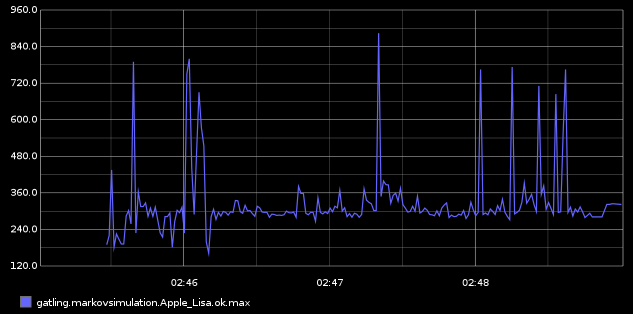
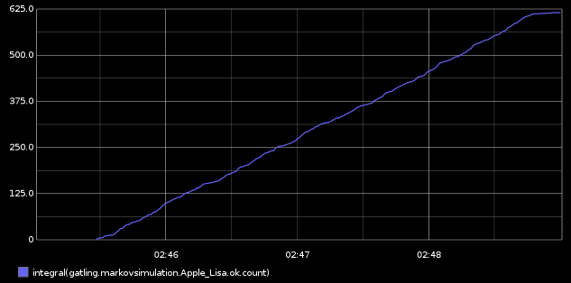

.. _realtime_monitoring:

###################
Realtime monitoring
###################

Gatling provides live statistics via the Graphite protocol so that you don't have to wait for the generation of the final report to analyse the simulation.
The graphite protocol is widely suppported by a number of tools. This includes both serverside monitoring and analytics databases.

In this way you can also monitor what happens in Gatling AND the system under test. All the data can be collected in one central repository for correlation.

The sections below describe both systems that collect data (Gatling, collectd, "Powershell functions", etc) and tools that recieve and process the data (Graphite, InfluxDB, and other timeseries databases).

The data the gatling pumps out via the graphite protocol can also be used to customize, tailor to your specific needs, the console output see below.

Metrics
=======

Two types of metrics are provided by Gatling  :
 * Users metrics
 * Requests metrics

Gatling pushes this data to Graphite every second by default, but the push frequency can be changed by setting the "writeInterval" in the GraphiteDataWriter section of gatling.conf

User metrics
------------

Users metrics give you, for each scenario of your simulation (or all scenarios using *allUsers*) :

* *waiting* : # of users waiting to start the scenario
* *active* : # of users currently running the scenario
* *done* : # of users who have completed the scenario

The metric path for users metrics is *gatling.scenarioName.users.metric*, where :

* *scenarioName* is the name of your scenario
* *metric* is one of the metrics described above

Request metrics
---------------

Requests metrics give you, for each request (or all requests using _allRequests_) and by status (OK, KO and both) :

* *count* : requests/sec
* *min* and *max* : Min and Max response time for the request
* *percentilesXX* :  1st, 2nd, 3rd and 4th percentiles, as defined in gatling.conf (defaults are 95th and 99th percentiles)

The metric path for requests metrics is *gatling.simulationId.requestName.status.metric*, where :

* *simulationId* is a sanitized named computed from the name of your Simulation, or the one you set in the command line prompt
* *requestName* is the name of your request
* *status* is either **ok** (for successful requests), **ko** (for failed requests) or **all** (for both successful and failed requests)
* *metric* is one of the metrics described above

System under test metrics
-------------------------

The system under test can send realtime data as follows to provide good visibility. This could be anything from cpu utilisation to database reads.
Following the "unix philosophy" sending the data to timeseries database and charting engines provides high quality monitoring and allows Gatling to focus on the load generation.

* For *Linux* collectd can collect system metrics and has plugins for a number of products such as mysql.
* For *Windows* "Graphite-PowerShell-Functions" on Github exposes windows performance counters to the graphite protocol.

For a complete list of tools that support sending data using the graphite protocol see: http://graphite.readthedocs.org/en/latest/tools.html

Configuration
=============

Gatling needs to be configured to send metrics.
In addition the tool that recieves and processes the data needs to be configured. For example one of Graphite, InfluxDB or other timeseries database that supports the Graphite protocol.

Gatling Configuration
---------------------

In ``$GATLING_HOME/conf/gatling.conf``, be sure to :

* have the GraphiteDataWriter in the list of writers
* have the correct host and port for Graphite

::

  data {
    writers = [console, file, graphite]
    reader = file

    graphite {
      host = "192.168.56.101"
      port = 2003
      #light = false              # only send the all* stats
      #protocol = "tcp"           # The protocol used to send data to Carbon (currently supported : "tcp", "udp")
      #rootPathPrefix = "gatling" # The common prefix of all metrics sent to Graphite
      #bufferSize = 8192          # GraphiteDataWriter's internal data buffer size, in bytes
      #writeInterval = 1          # GraphiteDataWriter's write interval, in seconds
    }
  }

Graphite tool configuration
---------------------------

In ``$GRAPHITE_HOME/conf/storage-schemas.conf``:

::

  [Gatling stats]
  priority = 110
  pattern = ^gatling\..*
  retentions = 1s:6d,10s:60d

If you use a different writeInterval in your GraphiteDataWriter configuration, makes sure that your smallest retention is equal or greater than your writeInterval.

In ``$GRAPHITE_HOME/conf/storage-aggregation.conf``:
::

  [sum]
  pattern = \.count$
  xFilesFactor = 0
  aggregationMethod = sum

  [min]
  pattern = \.min$
  xFilesFactor = 0.1
  aggregationMethod = min

  [max]
  pattern = \.max$
  xFilesFactor = 0.1
  aggregationMethod = max

  [default_average]
  pattern = .*
  xFilesFactor = 0.3
  aggregationMethod = average

InfluxDB tool configuration
---------------------------

InfluxDB does not need any storage configuration initially, but some changes to the config.toml to enable the Graphite protocol.
It does not have a charting component however, so it integrates with a dedicated charting tool, for example Grafana.

::

  [input_plugins]
   
  # Configure the graphite api
  [input_plugins.graphite]
  enabled = true
  port = 2003
  database = "gatling"  # store graphite data in this database
  # udp_enabled = true # enable udp interface on the same port as the tcp interface

collectd configuration
----------------------

collectd needs configuring in the collectd.conf file after installation:

::

  ...
  LoadPlugin write_graphite
  ...
  <Plugin write_graphite>
   <Node "example">
    Host "receiving.server.hostname"
    Port "2003"
    Protocol "tcp"
    LogSendErrors true
    Prefix "collectd"
    Postfix "collectd"
    StoreRates true
    AlwaysAppendDS false
    EscapeCharacter "_"
   </Node>
  </Plugin>
  ...

Graphite powershell functions configuration
-------------------------------------------

See the documentation here : https://github.com/MattHodge/Graphite-PowerShell-Functions

Customizable console output via graphite datastream
---------------------------------------------------

Reporting can be a very user/system specific requirement. One possibility to obtain exactly what you want from realtime monitoring in the console is described below.

Advantages of this approach are:

* You can script the format and contents of the output exactly as you want
* No need to set up Graphite server or timeseries databases as described above, which can take time.
* Frees up Gatling developers to concentrate on the core DSL and injection, etc, components.
* Inject load on 1 server and report to a console on another server (ProTip: if you have 5 injectors, the data can be sent to 1 central server...)

Limitations:

* currently as described this will only work on X-platforms (Unix, Linux, OS X) load injectors (further work could adapt the setup for Windows in the future)

Set up:

* Enable the graphite output in gatling.conf as above
* open a new console to write the realtime data to
* Modify to your requirements and run "netcat" listening on port 2003 (the default for the graphite protocol), and pipe the output to commands that will format the data as you wish.
* Start your test

Scripts for running netcat and processing the output:

::

  # command to run the graphite console output
  nc -l 2003 | awk -f a.awk | tee gatling_stats.txt

::

  # awk script to process raw graphite protocol data stream
  BEGIN{
    print "--------- stats ....... timestamp RPS error_percent 95percentile_response_time active_users -----";
    curr=0
  }
  
  {
    if($NF != curr) {
      print $NF" "n" "epct" "ptile" "u;
    }
    curr=$NF
  }
  
  /allRequests.all.count/        {n=$2}
  /allRequests.ko.count/         {e=$2; if(n==0){epct=0}else{epct=int(e/n*100)}}
  /allRequests.ok.percentiles95/ {ptile=$2}
  /users.allUsers.active/        {u=$2}

Graphite tool chart Examples
============================

All the following charts have been done with this line mode : ``Graph Options\Line Mode\Connected Line``

Graphing the ``.max`` is usually a good start to monitor a given request.

One may be interested in monitoring the number of requests per second with ``.count``.

.. image:: img/count.png
  :alt: CountEvolution

One can easily graph the total number of requests executed thanks to the Graphite ``integral()`` function.

